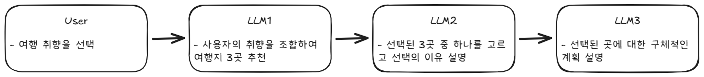
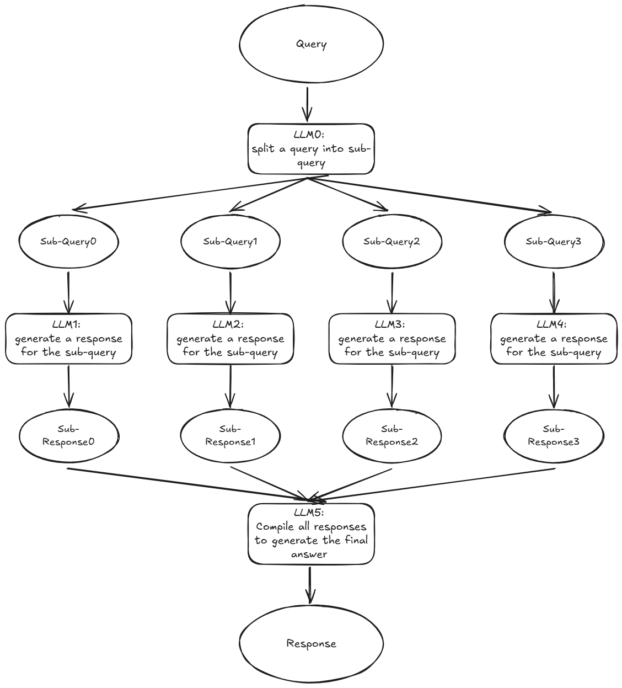
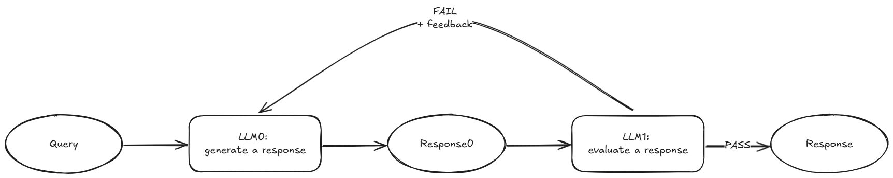

# AI Agent Scratch

- reference: https://www.anthropic.com/engineering/building-effective-agents
- https://www.youtube.com/watch?v=3wk45Ow3m3M
- https://github.com/dabidstudio/python-ai-agents/tree/main

>이 튜토리얼은 일부러 langchain을 거의 사용하지 않고 만들었다. 이 과정을 통해서 agent의 작동 방식과 원리를 좀 더 자세하게 알 수 있을 것으로 생각 된다.

## Prompt Chaining

### Prompt Chaining 이란?



prompt chaining 예시

- `Prompt Chaining`이란 여러 단계의 `prompt`를 엮어서 사용자의 질문에 보다 구체적이고 정확한 답변을 할 수 있도록 만드는 방법

1. 단계별 문제 해결(Step-by-Step Reasoning)
   - 한 번에 복잡한 문제를 풀기 어려운 경우, 여러 개의 작은 문제로 나누어 해결
2. 출력 재사용(Intermediate Output Utilization)
   - 첫 번째 프롬프트에서 생성된 출력을 다음 프롬프트에서 입력으로 사용
   - Ex) 요약 → 키워드 추출→ 질문 생성과 같은 과정
3. 다단계 검증
   - 한 모델의 출력을 다른 프롬프트로 검증하여 오류를 줄이는 방식

### Prompt Chaining 유형

1. Linear Chaining

   - A→B→ C 순서로 진행

2. Branching Chaining

   - 하나의 프롬프트 출력이 여러 개의 다른 프롬프트로 분기하여 다양한 결과를 생성함

   ```python
   1. 프롬프트 1 → "주어진 기사 내용을 요약하세요." (출력: 요약문)
   2. 프롬프트 2 → "요약문을 기반으로 주요 키워드를 추출하세요."
   3. 프롬프트 3 → "요약문을 기반으로 질문을 생성하세요."
   ```

3. Iterative Chaining

   - 같은 프롬프트를 반복 실행하여 점진적으로 더 나은 출력을 생성하는 방식.
   - 

### Code

```python
from typing import List
from utils import llm_call

def prompt_chain_workflow(initial_input:str, prompt_chain: List[str]) -> List[str]:
    response_chain = []
    response = initial_input
    
    for i, prompt in enumerate(prompt_chain):
        print(f"\n==== STEP {i} ====\n")
        final_prompt = f"{prompt} \nUSER INPUTS:\n{response}"
        print(f"PROMPT:\n{final_prompt}")
        
        response = llm_call(final_prompt)
        response_chain.append(response)
        print(f"response: \n{response}\n")
    
    return response_chain
```

```python
initial_input ="""
나는 여름 휴가를 계획 중이야. 따뜻한 날씨를 좋아하고, 자연 경관과 역사적인 장소를 둘러보는 걸 좋아해.
어떤 여행지가 나에게 적합할까?
"""

# 프롬프트 체인: LLM이 단계적으로 여행을 계획하도록 유도
prompt_chain = [
    ## 여행 후보지 3곳을 추천하고 그 이유를 설명
"""사용자의 여행 취향을 바탕으로 적합한 여행지 3곳을 추천하세요. 
- 먼저 사용자가 입력한 희망사항을 요약해줘
- 사용자가 입력한 희망사항을 반영해서 왜 적합한 여행지인지 설명해주세요
- 각 여행지의 기후, 주요 관광지, 활동 등을 설명하세요.
""",

    ## 여행지 1곳을 선택하고 활동 5가지 나열
"""다음 여행지 3곳 중 하나를 선택하세요. 선택한 여행지 알려주세요. 그리고 선택한 이유를 설명해주세요.
- 해당 여행지에서 즐길 수 있는 주요 활동 5가지를 나열하세요. 
- 활동은 자연 탐방, 역사 탐방, 음식 체험 등 다양한 범주에서 포함되도록 하세요.
""",

    ## 선택한 여행지에서 하루 일정 계획
"""사용자가 하루 동안 이 여행지에서 시간을 보낼 계획입니다. 
- 오전, 오후, 저녁으로 나누어 일정을 짜고, 각 시간대에 어떤 활동을 하면 좋을지 설명하세요.
""",
]

responses = prompt_chain_workflow(initial_input,prompt_chain)

final_answer = responses[-1]
print(final_answer)
```

- output

  ==== STEP 0 ====

  PROMPT:
  사용자의 여행 취향을 바탕으로 적합한 여행지 3곳을 추천하세요.

  - 먼저 사용자가 입력한 희망사항을 요약해줘
  - 사용자가 입력한 희망사항을 반영해서 왜 적합한 여행지인지 설명해주세요
  - 각 여행지의 기후, 주요 관광지, 활동 등을 설명하세요.

  USER INPUTS:

  나는 여름 휴가를 계획 중이야. 따뜻한 날씨를 좋아하고, 자연 경관과 역사적인 장소를 둘러보는 걸 좋아해.
  어떤 여행지가 나에게 적합할까?

  response:
  사용자는 여름 휴가를 계획 중이며, 따뜻한 날씨와 아름다운 자연 경관, 그리고 역사적인 장소를 선호한다고 했습니다.  따라서 자연과 역사가 어우러진 따뜻한 기후의 여행지를 추천해 드리겠습니다.

  **추천 여행지 3곳:**

  1. **이탈리아 남부 (아말피 해안, 폼페이 등):**

  - **적합성:** 이탈리아 남부는 사용자의 모든 선호도를 충족하는 곳입니다. 아름다운 해안선과 그림 같은 마을들이 펼쳐지는 아말피 해안은 자연 경관을 만끽하기에 좋으며, 폼페이와 같은 고대 유적지는 역사 애호가에게 흥미로운 경험을 제공합니다. 여름에는 따뜻하고 햇살이 가득한 날씨를 경험할 수 있습니다.
  - **기후:** 여름에는 뜨겁고 건조하며, 습도가 높을 수 있습니다. 평균 기온은 25-30도 정도입니다. 해변에서는 더울 수 있으니 자외선 차단제와 수분 섭취에 신경 써야 합니다.
  - **주요 관광지:** 아말피 해안의 포지타노, 라벨로, 아말피 마을, 폼페이 유적, 베수비오 화산, 카프리 섬 등.
  - **활동:** 해변 휴양, 보트 투어, 고고학 유적지 탐방, 등산, 요리 수업, 와인 투어 등 다양한 활동이 가능합니다.

  1. **그리스 (산토리니, 아테네 등):**

  - **적합성:** 그리스는 아름다운 에게해의 섬들과 고대 유적지로 유명합니다. 산토리니 섬의 푸른 지중해와 하얀 건물들은 멋진 자연 경관을 제공하며, 아테네의 아크로폴리스는 역사적인 경험을 선사합니다. 여름에는 맑고 따뜻한 날씨를 기대할 수 있습니다.
  - **기후:** 여름에는 뜨겁고 건조하며, 햇볕이 강합니다. 평균 기온은 28-32도 정도입니다. 섬 지역이라 바람이 많이 불 수 있습니다.
  - **주요 관광지:** 산토리니 섬의 이아와 피라 마을, 아테네의 아크로폴리스, 파르테논 신전, 플라카 지역, 델포이 유적 등.
  - **활동:** 해변 휴양, 요트 투어, 고고학 유적지 탐방, 섬 탐험, 크루즈 여행 등

  1. **스페인 (세비야, 그라나다 등):**

  - **적합성:** 스페인은 아름다운 건축물과 풍부한 역사, 그리고 활기찬 문화를 자랑합니다. 세비야의 알카사르 궁전과 그라나다의 알함브라 궁전은 아름다운 역사 유적지이며, 안달루시아 지방의 아름다운 자연 경관도 감상할 수 있습니다. 여름은 덥지만 활기찬 분위기를 즐기기에 좋습니다.
  - **기후:** 여름에는 덥고 건조하며, 특히 안달루시아 지방은 매우 더울 수 있습니다. 평균 기온은 30-35도 정도입니다. 낮에는 햇볕이 강하므로 자외선 차단에 신경 써야 합니다.
  - **주요 관광지:** 세비야의 알카사르 궁전, 세비야 대성당, 플라멩고 공연장, 그라나다의 알함브라 궁전, 알바이신 지구 등.
  - **활동:** 역사 유적지 탐방, 플라멩고 공연 관람, 타파스 투어, 세비야의 정원 산책, 안달루시아 지방의 시골 풍경 탐방 등

  위 세 곳 모두 사용자의 여행 취향에 맞는 따뜻한 기후와 아름다운 자연, 역사적인 장소를 모두 경험할 수 있는 곳입니다.  선택은 사용자의 취향에 따라 달라질 수 있습니다. 예를 들어, 섬 휴가를 선호한다면 그리스가, 역사 유적지에 더 집중하고 싶다면 이탈리아 남부나 스페인이 더 적합할 수 있습니다.

  ==== STEP 1 ====

  PROMPT:
  다음 여행지 3곳 중 하나를 선택하세요. 선택한 여행지 알려주세요. 그리고 선택한 이유를 설명해주세요.

  - 해당 여행지에서 즐길 수 있는 주요 활동 5가지를 나열하세요.
  - 활동은 자연 탐방, 역사 탐방, 음식 체험 등 다양한 범주에서 포함되도록 하세요.

  USER INPUTS:
  사용자는 여름 휴가를 계획 중이며, 따뜻한 날씨와 아름다운 자연 경관, 그리고 역사적인 장소를 선호한다고 했습니다.  따라서 자연과 역사가 어우러진 따뜻한 기후의 여행지를 추천해 드리겠습니다.

  **추천 여행지 3곳:**

  1. **이탈리아 남부 (아말피 해안, 폼페이 등):**

  - **적합성:** 이탈리아 남부는 사용자의 모든 선호도를 충족하는 곳입니다. 아름다운 해안선과 그림 같은 마을들이 펼쳐지는 아말피 해안은 자연 경관을 만끽하기에 좋으며, 폼페이와 같은 고대 유적지는 역사 애호가에게 흥미로운 경험을 제공합니다. 여름에는 따뜻하고 햇살이 가득한 날씨를 경험할 수 있습니다.
  - **기후:** 여름에는 뜨겁고 건조하며, 습도가 높을 수 있습니다. 평균 기온은 25-30도 정도입니다. 해변에서는 더울 수 있으니 자외선 차단제와 수분 섭취에 신경 써야 합니다.
  - **주요 관광지:** 아말피 해안의 포지타노, 라벨로, 아말피 마을, 폼페이 유적, 베수비오 화산, 카프리 섬 등.
  - **활동:** 해변 휴양, 보트 투어, 고고학 유적지 탐방, 등산, 요리 수업, 와인 투어 등 다양한 활동이 가능합니다.

  1. **그리스 (산토리니, 아테네 등):**

  - **적합성:** 그리스는 아름다운 에게해의 섬들과 고대 유적지로 유명합니다. 산토리니 섬의 푸른 지중해와 하얀 건물들은 멋진 자연 경관을 제공하며, 아테네의 아크로폴리스는 역사적인 경험을 선사합니다. 여름에는 맑고 따뜻한 날씨를 기대할 수 있습니다.
  - **기후:** 여름에는 뜨겁고 건조하며, 햇볕이 강합니다. 평균 기온은 28-32도 정도입니다. 섬 지역이라 바람이 많이 불 수 있습니다.
  - **주요 관광지:** 산토리니 섬의 이아와 피라 마을, 아테네의 아크로폴리스, 파르테논 신전, 플라카 지역, 델포이 유적 등.
  - **활동:** 해변 휴양, 요트 투어, 고고학 유적지 탐방, 섬 탐험, 크루즈 여행 등

  1. **스페인 (세비야, 그라나다 등):**

  - **적합성:** 스페인은 아름다운 건축물과 풍부한 역사, 그리고 활기찬 문화를 자랑합니다. 세비야의 알카사르 궁전과 그라나다의 알함브라 궁전은 아름다운 역사 유적지이며, 안달루시아 지방의 아름다운 자연 경관도 감상할 수 있습니다. 여름은 덥지만 활기찬 분위기를 즐기기에 좋습니다.
  - **기후:** 여름에는 덥고 건조하며, 특히 안달루시아 지방은 매우 더울 수 있습니다. 평균 기온은 30-35도 정도입니다. 낮에는 햇볕이 강하므로 자외선 차단에 신경 써야 합니다.
  - **주요 관광지:** 세비야의 알카사르 궁전, 세비야 대성당, 플라멩고 공연장, 그라나다의 알함브라 궁전, 알바이신 지구 등.
  - **활동:** 역사 유적지 탐방, 플라멩고 공연 관람, 타파스 투어, 세비야의 정원 산책, 안달루시아 지방의 시골 풍경 탐방 등

  위 세 곳 모두 사용자의 여행 취향에 맞는 따뜻한 기후와 아름다운 자연, 역사적인 장소를 모두 경험할 수 있는 곳입니다.  선택은 사용자의 취향에 따라 달라질 수 있습니다. 예를 들어, 섬 휴가를 선호한다면 그리스가, 역사 유적지에 더 집중하고 싶다면 이탈리아 남부나 스페인이 더 적합할 수 있습니다.
  response:
  이탈리아 남부 (아말피 해안, 폼페이 등)를 선택하겠습니다.

  선택 이유는 아름다운 해안선과 그림 같은 마을들로 이루어진 아말피 해안의 자연 경관과, 폼페이와 같은 역사적인 유적지를 동시에 경험할 수 있기 때문입니다.  여름의 따뜻한 날씨와 더불어 다양한 활동을 즐길 수 있다는 점도 매력적입니다.  그리스와 스페인도 매력적이지만, 이탈리아 남부는 해안과 역사 유적지가 더욱 밀접하게 연결되어 있어 제가 원하는 "자연과 역사의 조화"를 가장 잘 만족시켜 줄 것으로 생각됩니다.

  이탈리아 남부에서 즐길 수 있는 주요 활동 5가지:

  1. **아말피 해안 보트 투어:** 아름다운 해안선과 절벽, 작은 마을들을 바다에서 감상하는 보트 투어는 이탈리아 남부 여행의 백미입니다. 다양한 크기의 보트 투어가 제공되며, 카프리 섬과 같은 인근 섬으로의 당일 여행도 가능합니다.
  2. **폼페이 유적지 탐방:** 베수비오 화산 폭발로 묻힌 고대 도시 폼페이를 탐험하며 고대 로마 문명의 흔적을 생생하게 느낄 수 있습니다. 잘 보존된 건물들과 생활 유적들을 통해 당시 사람들의 삶을 엿볼 수 있습니다.
  3. **포지타노 마을 산책:** 아말피 해안의 대표적인 마을인 포지타노는 알록달록한 집들과 좁은 골목길, 아름다운 해변이 어우러진 그림 같은 풍경을 자랑합니다. 마을을 걸으며 사진을 찍고, 해변에서 휴식을 취할 수 있습니다.
  4. **나폴리 피자 만들기 체험:** 나폴리 피자는 세계적으로 유명한 이탈리아 음식입니다. 현지 요리 강습에 참여하여 나폴리 피자를 직접 만들어보고, 맛있는 피자를 즐길 수 있습니다.
  5. **베수비오 화산 등산:** 폼페이를 멸망시킨 베수비오 화산에 등산하여 화산의 장엄한 모습과 아름다운 전망을 감상할 수 있습니다. 등산 코스는 다양한 난이도로 제공됩니다.

  ==== STEP 2 ====

  PROMPT:
  사용자가 하루 동안 이 여행지에서 시간을 보낼 계획입니다.

  - 오전, 오후, 저녁으로 나누어 일정을 짜고, 각 시간대에 어떤 활동을 하면 좋을지 설명하세요.

  USER INPUTS:
  이탈리아 남부 (아말피 해안, 폼페이 등)를 선택하겠습니다.

  선택 이유는 아름다운 해안선과 그림 같은 마을들로 이루어진 아말피 해안의 자연 경관과, 폼페이와 같은 역사적인 유적지를 동시에 경험할 수 있기 때문입니다.  여름의 따뜻한 날씨와 더불어 다양한 활동을 즐길 수 있다는 점도 매력적입니다.  그리스와 스페인도 매력적이지만, 이탈리아 남부는 해안과 역사 유적지가 더욱 밀접하게 연결되어 있어 제가 원하는 "자연과 역사의 조화"를 가장 잘 만족시켜 줄 것으로 생각됩니다.

  이탈리아 남부에서 즐길 수 있는 주요 활동 5가지:

  1. **아말피 해안 보트 투어:** 아름다운 해안선과 절벽, 작은 마을들을 바다에서 감상하는 보트 투어는 이탈리아 남부 여행의 백미입니다. 다양한 크기의 보트 투어가 제공되며, 카프리 섬과 같은 인근 섬으로의 당일 여행도 가능합니다.
  2. **폼페이 유적지 탐방:** 베수비오 화산 폭발로 묻힌 고대 도시 폼페이를 탐험하며 고대 로마 문명의 흔적을 생생하게 느낄 수 있습니다. 잘 보존된 건물들과 생활 유적들을 통해 당시 사람들의 삶을 엿볼 수 있습니다.
  3. **포지타노 마을 산책:** 아말피 해안의 대표적인 마을인 포지타노는 알록달록한 집들과 좁은 골목길, 아름다운 해변이 어우러진 그림 같은 풍경을 자랑합니다. 마을을 걸으며 사진을 찍고, 해변에서 휴식을 취할 수 있습니다.
  4. **나폴리 피자 만들기 체험:** 나폴리 피자는 세계적으로 유명한 이탈리아 음식입니다. 현지 요리 강습에 참여하여 나폴리 피자를 직접 만들어보고, 맛있는 피자를 즐길 수 있습니다.
  5. **베수비오 화산 등산:** 폼페이를 멸망시킨 베수비오 화산에 등산하여 화산의 장엄한 모습과 아름다운 전망을 감상할 수 있습니다. 등산 코스는 다양한 난이도로 제공됩니다.
     response:
     하루 동안 이탈리아 남부(아말피 해안 & 폼페이) 여행 일정 (여름 기준):

  **오전 (8:00 AM - 12:00 PM): 폼페이 유적지 탐방**

  - 8:00 AM: 폼페이 유적지로 이동. (숙소 위치에 따라 대중교통 또는 택시 이용) 여름철 강한 햇볕을 고려하여 모자, 선크림, 물을 충분히 준비합니다.
  - 8:30 AM - 11:30 AM: 폼페이 유적지 탐방. 넓은 지역이므로, 미리 관심 있는 구역을 정하고 효율적인 동선을 계획하는 것이 좋습니다. 오디오 가이드 또는 가이드 투어를 이용하면 더욱 풍부한 경험을 할 수 있습니다. 주요 건물, 광장, 상점 등을 둘러보며 고대 로마 생활상을 느껴봅니다.
  - 11:30 AM: 유적지 내 매점 또는 근처 카페에서 간단한 간식과 음료를 섭취합니다.

  **오후 (12:00 PM - 6:00 PM): 아말피 해안 탐험**

  - 12:00 PM - 1:00 PM: 폼페이에서 포지타노로 이동 (버스 또는 택시 이용). 이동 시간을 고려하여 미리 출발하는 것이 좋습니다.
  - 1:00 PM - 2:00 PM: 포지타노 마을에서 점심 식사. 해변가 레스토랑에서 신선한 해산물 요리 또는 이탈리아 파스타를 즐깁니다.
  - 2:00 PM - 4:00 PM: 포지타노 마을 산책. 알록달록한 집들과 좁은 골목길을 걸으며 사진을 찍고, 아름다운 해변에서 휴식을 취합니다. 스파그노라 해변(Spiaggia Grande) 등 사진 찍기 좋은 장소를 찾아보세요.
  - 4:00 PM - 6:00 PM: 아말피 해안 보트 투어 (선택). 시간적 여유가 있다면 아말피 해안의 아름다운 풍경을 보트에서 감상하는 투어를 즐길 수 있습니다. 짧은 투어를 선택하여 시간을 효율적으로 관리하는 것이 좋습니다.

  **저녁 (6:00 PM - 10:00 PM): 나폴리 & 휴식**

  - 6:00 PM - 7:00 PM: 포지타노에서 나폴리로 이동 (버스 또는 택시 이용).
  - 7:00 PM - 8:00 PM: 나폴리에서 나폴리 피자 만들기 체험 (선택). 미리 예약을 하고 참여합니다. 시간이 부족하다면 현지 맛집에서 나폴리 피자를 즐기는 것도 좋습니다.
  - 8:00 PM - 9:00 PM: 나폴리 시내 관광 (선택). 피자 체험 후 시간이 남는다면 나폴리 시내를 잠깐 둘러볼 수 있습니다.
  - 9:00 PM - 10:00 PM: 숙소로 이동하여 휴식.

  **참고사항:**

  - 이 일정은 매우 빡빡하므로, 시간 관리에 유의해야 합니다. 선호하는 활동에 따라 일정을 조정하는 것이 좋습니다.
  - 여름철에는 햇볕이 강하므로, 자외선 차단제, 모자, 선글라스 등을 꼭 준비해야 합니다.
  - 대중교통 이용 시 시간표를 미리 확인하고, 필요에 따라 택시를 이용하는 것을 고려합니다.
  - 숙소 위치에 따라 이동 시간이 달라질 수 있습니다. 숙소를 선택할 때 교통편을 고려하는 것이 좋습니다.
  - 베수비오 화산 등산은 시간이 많이 소요되므로, 이번 여행에서는 제외했습니다. 다음 기회에 좀 더 여유로운 일정으로 방문하는 것을 추천합니다.

  이 일정을 바탕으로 자신에게 맞는 여행 계획을 세우시면 즐거운 이탈리아 남부 여행이 될 것입니다.

  하루 동안 이탈리아 남부(아말피 해안 & 폼페이) 여행 일정 (여름 기준):

  **오전 (8:00 AM - 12:00 PM): 폼페이 유적지 탐방**

  - 8:00 AM: 폼페이 유적지로 이동. (숙소 위치에 따라 대중교통 또는 택시 이용) 여름철 강한 햇볕을 고려하여 모자, 선크림, 물을 충분히 준비합니다.
  - 8:30 AM - 11:30 AM: 폼페이 유적지 탐방. 넓은 지역이므로, 미리 관심 있는 구역을 정하고 효율적인 동선을 계획하는 것이 좋습니다. 오디오 가이드 또는 가이드 투어를 이용하면 더욱 풍부한 경험을 할 수 있습니다. 주요 건물, 광장, 상점 등을 둘러보며 고대 로마 생활상을 느껴봅니다.
  - 11:30 AM: 유적지 내 매점 또는 근처 카페에서 간단한 간식과 음료를 섭취합니다.

  **오후 (12:00 PM - 6:00 PM): 아말피 해안 탐험**

  - 12:00 PM - 1:00 PM: 폼페이에서 포지타노로 이동 (버스 또는 택시 이용). 이동 시간을 고려하여 미리 출발하는 것이 좋습니다.
  - 1:00 PM - 2:00 PM: 포지타노 마을에서 점심 식사. 해변가 레스토랑에서 신선한 해산물 요리 또는 이탈리아 파스타를 즐깁니다.
  - 2:00 PM - 4:00 PM: 포지타노 마을 산책. 알록달록한 집들과 좁은 골목길을 걸으며 사진을 찍고, 아름다운 해변에서 휴식을 취합니다. 스파그노라 해변(Spiaggia Grande) 등 사진 찍기 좋은 장소를 찾아보세요.
  - 4:00 PM - 6:00 PM: 아말피 해안 보트 투어 (선택). 시간적 여유가 있다면 아말피 해안의 아름다운 풍경을 보트에서 감상하는 투어를 즐길 수 있습니다. 짧은 투어를 선택하여 시간을 효율적으로 관리하는 것이 좋습니다.

  **저녁 (6:00 PM - 10:00 PM): 나폴리 & 휴식**

  - 6:00 PM - 7:00 PM: 포지타노에서 나폴리로 이동 (버스 또는 택시 이용).
  - 7:00 PM - 8:00 PM: 나폴리에서 나폴리 피자 만들기 체험 (선택). 미리 예약을 하고 참여합니다. 시간이 부족하다면 현지 맛집에서 나폴리 피자를 즐기는 것도 좋습니다.
  - 8:00 PM - 9:00 PM: 나폴리 시내 관광 (선택). 피자 체험 후 시간이 남는다면 나폴리 시내를 잠깐 둘러볼 수 있습니다.
  - 9:00 PM - 10:00 PM: 숙소로 이동하여 휴식.

  **참고사항:**

  - 이 일정은 매우 빡빡하므로, 시간 관리에 유의해야 합니다. 선호하는 활동에 따라 일정을 조정하는 것이 좋습니다.
  - 여름철에는 햇볕이 강하므로, 자외선 차단제, 모자, 선글라스 등을 꼭 준비해야 합니다.
  - 대중교통 이용 시 시간표를 미리 확인하고, 필요에 따라 택시를 이용하는 것을 고려합니다.
  - 숙소 위치에 따라 이동 시간이 달라질 수 있습니다. 숙소를 선택할 때 교통편을 고려하는 것이 좋습니다.
  - 베수비오 화산 등산은 시간이 많이 소요되므로, 이번 여행에서는 제외했습니다. 다음 기회에 좀 더 여유로운 일정으로 방문하는 것을 추천합니다.

  이 일정을 바탕으로 자신에게 맞는 여행 계획을 세우시면 즐거운 이탈리아 남부 여행이 될 것입니다.

```python
initial_input ="""
회사에 AI Agent 비즈니스의 필요성에 대해서 설들하고 싶은데 어떻게 하면 좋을까? 우리 회사는 제조업 분야의 IT 솔루션을 개발하는 회사야. 사업의 타당성을 설득할 수 있는 보고서를 작성해줘.
"""

# 프롬프트 체인: LLM이 단계적으로 여행을 계획하도록 유도
prompt_chain = [
"""Analyze the user's input and determine the key intent, topic, and constraints. If the input is ambiguous, identify clarifying questions to ask the user
""",

"""Break down the user's request into smaller tasks or components. Identify any missing information needed to fulfill the request and gather relevant data or context.
""",

"""Define the best response format based on the user's intent. Choose an appropriate approach (e.g., step-by-step explanation, summary, creative response) and generate a structured plan.
""",

"""Generate a clear, detailed, and contextually appropriate response based on the structured plan. Ensure coherence, accuracy, and engagement.""",

"""Review the generated response for clarity, completeness, and alignment with the user's intent. If necessary, refine the response to improve readability, conciseness, or accuracy.
answer language is Korean
"""
]

responses = prompt_chain_workflow(initial_input,prompt_chain)

final_answer = responses[-1]
print(final_answer)
```

- output

  ==== STEP 0 ====

  PROMPT:
  Analyze the user's input and determine the key intent, topic, and constraints. If the input is ambiguous, identify clarifying questions to ask the user

  USER INPUTS:

  회사에 AI Agent 비즈니스의 필요성에 대해서 설들하고 싶은데 어떻게 하면 좋을까? 우리 회사는 제조업 분야의 IT 솔루션을 개발하는 회사야. 사업의 타당성을 설득할 수 있는 보고서를 작성해줘.

  response: 

  ## Analysis of User Input:

  **Key Intent:** The user wants to persuade their company to adopt an AI Agent business.  They need help creating a convincing business case.

  **Topic:**  The feasibility and business case for integrating AI Agent technology into a manufacturing IT solutions company.

  **Constraints:**

  * **Industry:** Manufacturing IT solutions.  This significantly impacts the potential applications and value proposition of the AI Agent.
  * **Target Audience:**  The user's company (likely management or stakeholders).  The report needs to be tailored to their understanding and concerns.
  * **Output:** A business report demonstrating the viability of the AI Agent initiative.

  **Ambiguities and Clarifying Questions:**

  1. **Specific AI Agent application:**  The user mentions AI Agents broadly.  To create a compelling report, we need specifics.  Clarifying questions:
     * "What specific tasks or problems do you envision the AI Agent addressing within your company's manufacturing IT solutions?  Could you provide examples?"
     * "What type of AI Agent are you considering (e.g., chatbot, process automation, predictive maintenance)?  Are there any specific platforms or technologies you're interested in?"

  2. **Current IT infrastructure:** The existing IT infrastructure will heavily influence integration costs and feasibility.
     * "What is the current state of your company's IT infrastructure?  Are there any existing systems that could integrate with an AI Agent?"

  3. **Metrics for success:**  The report needs quantifiable metrics to demonstrate ROI.
     * "What key performance indicators (KPIs) will be used to measure the success of implementing the AI Agent? (e.g., cost reduction, efficiency gains, improved customer satisfaction)"

  4. **Budget and timeline:**  These constraints are crucial for realistic planning.
     * "Is there a preliminary budget allocated for this project?  What is the desired timeline for implementation?"

  5. **Competitive landscape:** Understanding the competition is essential for a strong business case.
     * "Are there any competitors already using AI Agents in similar ways within the manufacturing industry?  What are their successes and challenges?"

  6. **Target audience's concerns:** Anticipating potential objections will strengthen the report.
     * "What are the main concerns or potential objections you anticipate from your colleagues regarding this proposal?"

  By addressing these ambiguities, a much more effective and persuasive business report can be created.

  ==== STEP 1 ====

  PROMPT:
  Break down the user's request into smaller tasks or components. Identify any missing information needed to fulfill the request and gather relevant data or context.

  USER INPUTS:

  ## Analysis of User Input:

  **Key Intent:** The user wants to persuade their company to adopt an AI Agent business.  They need help creating a convincing business case.

  **Topic:**  The feasibility and business case for integrating AI Agent technology into a manufacturing IT solutions company.

  **Constraints:**

  * **Industry:** Manufacturing IT solutions.  This significantly impacts the potential applications and value proposition of the AI Agent.
  * **Target Audience:**  The user's company (likely management or stakeholders).  The report needs to be tailored to their understanding and concerns.
  * **Output:** A business report demonstrating the viability of the AI Agent initiative.

  **Ambiguities and Clarifying Questions:**

  1. **Specific AI Agent application:**  The user mentions AI Agents broadly.  To create a compelling report, we need specifics.  Clarifying questions:
     * "What specific tasks or problems do you envision the AI Agent addressing within your company's manufacturing IT solutions?  Could you provide examples?"
     * "What type of AI Agent are you considering (e.g., chatbot, process automation, predictive maintenance)?  Are there any specific platforms or technologies you're interested in?"

  2. **Current IT infrastructure:** The existing IT infrastructure will heavily influence integration costs and feasibility.
     * "What is the current state of your company's IT infrastructure?  Are there any existing systems that could integrate with an AI Agent?"

  3. **Metrics for success:**  The report needs quantifiable metrics to demonstrate ROI.
     * "What key performance indicators (KPIs) will be used to measure the success of implementing the AI Agent? (e.g., cost reduction, efficiency gains, improved customer satisfaction)"

  4. **Budget and timeline:**  These constraints are crucial for realistic planning.
     * "Is there a preliminary budget allocated for this project?  What is the desired timeline for implementation?"

  5. **Competitive landscape:** Understanding the competition is essential for a strong business case.
     * "Are there any competitors already using AI Agents in similar ways within the manufacturing industry?  What are their successes and challenges?"

  6. **Target audience's concerns:** Anticipating potential objections will strengthen the report.
     * "What are the main concerns or potential objections you anticipate from your colleagues regarding this proposal?"

  By addressing these ambiguities, a much more effective and persuasive business report can be created.
  response: 
  This breakdown expands on the initial analysis, outlining the tasks and data needed for a compelling business case.

  **Phase 1: Information Gathering & Analysis**

  * **Task 1.1:  Clarify AI Agent Application:**  Conduct interviews with the user to identify specific use cases for the AI Agent within their manufacturing IT solutions company.  Examples might include:
    * **Predictive Maintenance:** Predicting equipment failures to minimize downtime.
    * **Chatbot for Customer Support:** Improving response times and customer satisfaction.
    * **Process Automation:** Automating repetitive tasks like data entry or report generation.
    * **Anomaly Detection:** Identifying unusual patterns in manufacturing data to prevent defects.
    * **Supply Chain Optimization:** Predicting demand and optimizing logistics.
  * **Task 1.2: Assess Current IT Infrastructure:** Gather information on the company's existing IT systems, including hardware, software, and network infrastructure.  Determine compatibility with potential AI Agent platforms.  This may involve reviewing documentation and potentially interviewing IT staff.
  * **Task 1.3: Define KPIs and Success Metrics:** Collaboratively define quantifiable KPIs to measure the success of the AI Agent implementation.  This should align with the company's overall business objectives.  Examples:
    * Reduced downtime (percentage or cost savings)
    * Increased efficiency (measured in time saved or units produced)
    * Improved customer satisfaction (measured through surveys or feedback)
    * Cost reduction (e.g., reduced labor costs, material waste)
  * **Task 1.4: Determine Budget and Timeline:** Obtain information on the available budget and the desired timeline for implementation from relevant stakeholders.
  * **Task 1.5: Competitive Analysis:** Research competitors in the manufacturing IT solutions space to identify those using AI Agents. Analyze their successes, challenges, and market impact.
  * **Task 1.6: Identify Stakeholder Concerns:**  Discuss potential objections or concerns from the target audience (management, stakeholders).  This helps preemptively address these in the business report.

  **Phase 2: Business Case Development**

  * **Task 2.1:  Develop a Problem Statement:** Clearly articulate the problem(s) the AI Agent will solve, supported by data and evidence.  Quantify the impact of the current situation (e.g., cost of downtime, lost productivity).
  * **Task 2.2: Propose AI Agent Solution:** Detail the chosen AI Agent solution, including the specific technology, platform, and implementation plan.  Explain how it addresses the identified problems.
  * **Task 2.3: Cost-Benefit Analysis:**  Develop a detailed cost-benefit analysis, including implementation costs (software, hardware, integration, training), ongoing maintenance costs, and projected return on investment (ROI) based on the defined KPIs.
  * **Task 2.4: Risk Assessment:** Identify potential risks and challenges associated with implementation and propose mitigation strategies.
  * **Task 2.5:  Implementation Plan:**  Create a detailed implementation plan outlining the phases, timelines, and responsibilities.
  * **Task 2.6: Draft Business Report:**  Compile all gathered information into a persuasive and well-structured business report, including executive summary, problem statement, proposed solution, cost-benefit analysis, risk assessment, implementation plan, and conclusion.

  **Phase 3: Presentation & Refinement**

  * **Task 3.1:  Present Business Report:** Present the completed business report to the target audience.
  * **Task 3.2:  Address Feedback:** Incorporate feedback from the presentation into the report to strengthen the argument.

  **Data Needed:**

  * Existing IT infrastructure documentation.
  * Company financial data (relevant to cost-benefit analysis).
  * Market research data on AI Agent adoption in manufacturing.
  * Competitor information.
  * Stakeholder interviews and feedback.

  This detailed breakdown provides a structured approach to creating a compelling business case for AI Agent adoption.  The success hinges on thorough research, clear communication, and a data-driven approach.

  ==== STEP 2 ====

  PROMPT:
  Define the best response format based on the user's intent. Choose an appropriate approach (e.g., step-by-step explanation, summary, creative response) and generate a structured plan.

  USER INPUTS:
  This breakdown expands on the initial analysis, outlining the tasks and data needed for a compelling business case.

  **Phase 1: Information Gathering & Analysis**

  * **Task 1.1:  Clarify AI Agent Application:**  Conduct interviews with the user to identify specific use cases for the AI Agent within their manufacturing IT solutions company.  Examples might include:
    * **Predictive Maintenance:** Predicting equipment failures to minimize downtime.
    * **Chatbot for Customer Support:** Improving response times and customer satisfaction.
    * **Process Automation:** Automating repetitive tasks like data entry or report generation.
    * **Anomaly Detection:** Identifying unusual patterns in manufacturing data to prevent defects.
    * **Supply Chain Optimization:** Predicting demand and optimizing logistics.
  * **Task 1.2: Assess Current IT Infrastructure:** Gather information on the company's existing IT systems, including hardware, software, and network infrastructure.  Determine compatibility with potential AI Agent platforms.  This may involve reviewing documentation and potentially interviewing IT staff.
  * **Task 1.3: Define KPIs and Success Metrics:** Collaboratively define quantifiable KPIs to measure the success of the AI Agent implementation.  This should align with the company's overall business objectives.  Examples:
    * Reduced downtime (percentage or cost savings)
    * Increased efficiency (measured in time saved or units produced)
    * Improved customer satisfaction (measured through surveys or feedback)
    * Cost reduction (e.g., reduced labor costs, material waste)
  * **Task 1.4: Determine Budget and Timeline:** Obtain information on the available budget and the desired timeline for implementation from relevant stakeholders.
  * **Task 1.5: Competitive Analysis:** Research competitors in the manufacturing IT solutions space to identify those using AI Agents. Analyze their successes, challenges, and market impact.
  * **Task 1.6: Identify Stakeholder Concerns:**  Discuss potential objections or concerns from the target audience (management, stakeholders).  This helps preemptively address these in the business report.

  **Phase 2: Business Case Development**

  * **Task 2.1:  Develop a Problem Statement:** Clearly articulate the problem(s) the AI Agent will solve, supported by data and evidence.  Quantify the impact of the current situation (e.g., cost of downtime, lost productivity).
  * **Task 2.2: Propose AI Agent Solution:** Detail the chosen AI Agent solution, including the specific technology, platform, and implementation plan.  Explain how it addresses the identified problems.
  * **Task 2.3: Cost-Benefit Analysis:**  Develop a detailed cost-benefit analysis, including implementation costs (software, hardware, integration, training), ongoing maintenance costs, and projected return on investment (ROI) based on the defined KPIs.
  * **Task 2.4: Risk Assessment:** Identify potential risks and challenges associated with implementation and propose mitigation strategies.
  * **Task 2.5:  Implementation Plan:**  Create a detailed implementation plan outlining the phases, timelines, and responsibilities.
  * **Task 2.6: Draft Business Report:**  Compile all gathered information into a persuasive and well-structured business report, including executive summary, problem statement, proposed solution, cost-benefit analysis, risk assessment, implementation plan, and conclusion.

  **Phase 3: Presentation & Refinement**

  * **Task 3.1:  Present Business Report:** Present the completed business report to the target audience.
  * **Task 3.2:  Address Feedback:** Incorporate feedback from the presentation into the report to strengthen the argument.

  **Data Needed:**

  * Existing IT infrastructure documentation.
  * Company financial data (relevant to cost-benefit analysis).
  * Market research data on AI Agent adoption in manufacturing.
  * Competitor information.
  * Stakeholder interviews and feedback.

  This detailed breakdown provides a structured approach to creating a compelling business case for AI Agent adoption.  The success hinges on thorough research, clear communication, and a data-driven approach.
  response: 
  The user's input is a detailed plan for creating a business case for AI agent adoption.  The best response format is a **structured summary with actionable next steps**.  This approach provides a concise overview while highlighting key tasks and responsibilities.  A creative response isn't necessary here; clarity and practicality are paramount.

  **Response Structure:**

  **I. Executive Summary:**  A brief overview of the plan, emphasizing its three phases: Information Gathering & Analysis, Business Case Development, and Presentation & Refinement.  Highlight the key deliverables (business report, cost-benefit analysis, implementation plan).

  **II.  Phase Breakdown with Action Items:** This section will expand on each phase, summarizing the tasks and assigning clear responsibilities (where possible).  It will transform the provided list into a more actionable project management-style outline.

  **III. Data Requirements Table:**  A clearly organized table detailing the necessary data, its source, and the responsible party for acquisition.

  **IV. Timeline & Milestones:** A suggested timeline with key milestones for each phase.  This will require estimating durations for each task (which can be iterative and refined).

  **V.  Next Steps:**  Concrete actionable steps for immediate action, focusing on the initial phase.

  **Structured Plan:**

  **I. Executive Summary:**

  This document outlines a three-phase plan for developing a compelling business case for AI agent adoption within a manufacturing IT solutions company.  The plan involves thorough information gathering, rigorous cost-benefit analysis, and a detailed implementation strategy, culminating in a comprehensive business report and presentation to key stakeholders.  Success hinges on data-driven decision-making and effective communication.

  **II. Phase Breakdown with Action Items:**

  | Phase                                         | Task                                 | Responsibility                   | Status      | Due Date (Estimate) | Notes                                                        |
  | --------------------------------------------- | ------------------------------------ | -------------------------------- | ----------- | ------------------- | ------------------------------------------------------------ |
  | **Phase 1: Information Gathering & Analysis** | 1.1 Clarify AI Agent Application     | Project Manager, User Interviews | Not Started | 1 week              | Conduct interviews to define specific use cases.             |
  |                                               | 1.2 Assess Current IT Infrastructure | IT Team, Project Manager         | Not Started | 1 week              | Gather documentation and interview IT staff.                 |
  |                                               | 1.3 Define KPIs & Success Metrics    | Project Manager, Stakeholders    | Not Started | 1 week              | Collaboratively define quantifiable KPIs aligned with business objectives. |
  |                                               | 1.4 Determine Budget & Timeline      | Finance Team, Project Manager    | Not Started | 1 week              | Obtain budget and timeline information from stakeholders.    |
  |                                               | 1.5 Competitive Analysis             | Market Research Team             | Not Started | 2 weeks             | Research competitors and analyze their AI agent adoption.    |
  |                                               | 1.6 Identify Stakeholder Concerns    | Project Manager, Stakeholders    | Not Started | 1 week              | Discuss and document potential objections.                   |
  | **Phase 2: Business Case Development**        | 2.1 Develop Problem Statement        | Project Manager, Data Analyst    | Not Started | 2 weeks             | Quantify the impact of the current situation using data from Phase 1. |
  |                                               | 2.2 Propose AI Agent Solution        | Technical Team, Project Manager  | Not Started | 2 weeks             | Detail the chosen AI Agent solution, including implementation plan. |
  |                                               | 2.3 Cost-Benefit Analysis            | Finance Team, Data Analyst       | Not Started | 3 weeks             | Develop detailed cost-benefit analysis, including ROI projections. |
  |                                               | 2.4 Risk Assessment                  | Project Manager, Technical Team  | Not Started | 1 week              | Identify potential risks and propose mitigation strategies.  |
  |                                               | 2.5 Implementation Plan              | Project Manager, Technical Team  | Not Started | 2 weeks             | Create a detailed implementation plan outlining phases, timelines, and roles. |
  |                                               | 2.6 Draft Business Report            | Project Manager, All Teams       | Not Started | 1 week              | Compile all information into a well-structured report.       |
  | **Phase 3: Presentation & Refinement**        | 3.1 Present Business Report          | Project Manager, All Teams       | Not Started | 1 week              | Present the report to stakeholders.                          |
  |                                               | 3.2 Address Feedback                 | Project Manager, All Teams       | Not Started | 1 week              | Incorporate feedback and refine the report.                  |

  **III. Data Requirements Table:**

  | Data Item                       | Source                             | Responsible Party    |
  | ------------------------------- | ---------------------------------- | -------------------- |
  | Existing IT Infrastructure Docs | IT Department                      | IT Team              |
  | Company Financial Data          | Finance Department                 | Finance Team         |
  | Market Research Data            | Market Research Reports, Databases | Market Research Team |
  | Competitor Information          | Public Sources, Industry Reports   | Market Research Team |
  | Stakeholder Interviews/Feedback | Interviews, Surveys                | Project Manager      |

  **IV. Timeline & Milestones:** (Estimates - to be refined)  Total project time: Approximately 8-10 weeks.

  **V. Next Steps:**

  1. **Schedule meetings:**  Schedule kickoff meetings with the IT team, finance team, and key stakeholders to begin data gathering.
  2. **Initiate interviews:** Conduct interviews to clarify AI agent application and identify specific use cases (Task 1.1).
  3. **Gather IT infrastructure data:** Begin collecting documentation and interviewing IT staff to assess current IT infrastructure (Task 1.2).

  This structured summary provides a clear path forward for creating a compelling business case.  The timeline and responsibilities can be further refined as the project progresses.

  ==== STEP 3 ====

  PROMPT:
  Generate a clear, detailed, and contextually appropriate response based on the structured plan. Ensure coherence, accuracy, and engagement. 
  USER INPUTS:
  The user's input is a detailed plan for creating a business case for AI agent adoption.  The best response format is a **structured summary with actionable next steps**.  This approach provides a concise overview while highlighting key tasks and responsibilities.  A creative response isn't necessary here; clarity and practicality are paramount.

  **Response Structure:**

  **I. Executive Summary:**  A brief overview of the plan, emphasizing its three phases: Information Gathering & Analysis, Business Case Development, and Presentation & Refinement.  Highlight the key deliverables (business report, cost-benefit analysis, implementation plan).

  **II.  Phase Breakdown with Action Items:** This section will expand on each phase, summarizing the tasks and assigning clear responsibilities (where possible).  It will transform the provided list into a more actionable project management-style outline.

  **III. Data Requirements Table:**  A clearly organized table detailing the necessary data, its source, and the responsible party for acquisition.

  **IV. Timeline & Milestones:** A suggested timeline with key milestones for each phase.  This will require estimating durations for each task (which can be iterative and refined).

  **V.  Next Steps:**  Concrete actionable steps for immediate action, focusing on the initial phase.

  **Structured Plan:**

  **I. Executive Summary:**

  This document outlines a three-phase plan for developing a compelling business case for AI agent adoption within a manufacturing IT solutions company.  The plan involves thorough information gathering, rigorous cost-benefit analysis, and a detailed implementation strategy, culminating in a comprehensive business report and presentation to key stakeholders.  Success hinges on data-driven decision-making and effective communication.

  **II. Phase Breakdown with Action Items:**

  | Phase                                         | Task                                 | Responsibility                   | Status      | Due Date (Estimate) | Notes                                                        |
  | --------------------------------------------- | ------------------------------------ | -------------------------------- | ----------- | ------------------- | ------------------------------------------------------------ |
  | **Phase 1: Information Gathering & Analysis** | 1.1 Clarify AI Agent Application     | Project Manager, User Interviews | Not Started | 1 week              | Conduct interviews to define specific use cases.             |
  |                                               | 1.2 Assess Current IT Infrastructure | IT Team, Project Manager         | Not Started | 1 week              | Gather documentation and interview IT staff.                 |
  |                                               | 1.3 Define KPIs & Success Metrics    | Project Manager, Stakeholders    | Not Started | 1 week              | Collaboratively define quantifiable KPIs aligned with business objectives. |
  |                                               | 1.4 Determine Budget & Timeline      | Finance Team, Project Manager    | Not Started | 1 week              | Obtain budget and timeline information from stakeholders.    |
  |                                               | 1.5 Competitive Analysis             | Market Research Team             | Not Started | 2 weeks             | Research competitors and analyze their AI agent adoption.    |
  |                                               | 1.6 Identify Stakeholder Concerns    | Project Manager, Stakeholders    | Not Started | 1 week              | Discuss and document potential objections.                   |
  | **Phase 2: Business Case Development**        | 2.1 Develop Problem Statement        | Project Manager, Data Analyst    | Not Started | 2 weeks             | Quantify the impact of the current situation using data from Phase 1. |
  |                                               | 2.2 Propose AI Agent Solution        | Technical Team, Project Manager  | Not Started | 2 weeks             | Detail the chosen AI Agent solution, including implementation plan. |
  |                                               | 2.3 Cost-Benefit Analysis            | Finance Team, Data Analyst       | Not Started | 3 weeks             | Develop detailed cost-benefit analysis, including ROI projections. |
  |                                               | 2.4 Risk Assessment                  | Project Manager, Technical Team  | Not Started | 1 week              | Identify potential risks and propose mitigation strategies.  |
  |                                               | 2.5 Implementation Plan              | Project Manager, Technical Team  | Not Started | 2 weeks             | Create a detailed implementation plan outlining phases, timelines, and roles. |
  |                                               | 2.6 Draft Business Report            | Project Manager, All Teams       | Not Started | 1 week              | Compile all information into a well-structured report.       |
  | **Phase 3: Presentation & Refinement**        | 3.1 Present Business Report          | Project Manager, All Teams       | Not Started | 1 week              | Present the report to stakeholders.                          |
  |                                               | 3.2 Address Feedback                 | Project Manager, All Teams       | Not Started | 1 week              | Incorporate feedback and refine the report.                  |

  **III. Data Requirements Table:**

  | Data Item                       | Source                             | Responsible Party    |
  | ------------------------------- | ---------------------------------- | -------------------- |
  | Existing IT Infrastructure Docs | IT Department                      | IT Team              |
  | Company Financial Data          | Finance Department                 | Finance Team         |
  | Market Research Data            | Market Research Reports, Databases | Market Research Team |
  | Competitor Information          | Public Sources, Industry Reports   | Market Research Team |
  | Stakeholder Interviews/Feedback | Interviews, Surveys                | Project Manager      |

  **IV. Timeline & Milestones:** (Estimates - to be refined)  Total project time: Approximately 8-10 weeks.

  **V. Next Steps:**

  1. **Schedule meetings:**  Schedule kickoff meetings with the IT team, finance team, and key stakeholders to begin data gathering.
  2. **Initiate interviews:** Conduct interviews to clarify AI agent application and identify specific use cases (Task 1.1).
  3. **Gather IT infrastructure data:** Begin collecting documentation and interviewing IT staff to assess current IT infrastructure (Task 1.2).

  This structured summary provides a clear path forward for creating a compelling business case.  The timeline and responsibilities can be further refined as the project progresses.
  response: 
  **I. Executive Summary:**

  This document outlines a three-phase plan for developing a business case for AI agent adoption within our manufacturing IT solutions company. The plan comprises Information Gathering & Analysis, Business Case Development, and Presentation & Refinement.  Key deliverables include a comprehensive business report, a detailed cost-benefit analysis, and a robust implementation plan.  Success will be measured by the creation of a data-driven case that effectively communicates the value proposition to key stakeholders.

  **II. Phase Breakdown with Action Items:**

  The following table details the project phases, tasks, responsibilities, and estimated timelines.  Note that these timelines are initial estimates and will be refined as the project progresses.

  | Phase                                                     | Task                                 | Responsibility                   | Status      | Due Date (Estimate) | Notes                                                        |
  | --------------------------------------------------------- | ------------------------------------ | -------------------------------- | ----------- | ------------------- | ------------------------------------------------------------ |
  | **Phase 1: Information Gathering & Analysis (Weeks 1-4)** | 1.1 Clarify AI Agent Application     | Project Manager, User Interviews | Not Started | Week 1              | Conduct interviews to define specific use cases.             |
  |                                                           | 1.2 Assess Current IT Infrastructure | IT Team, Project Manager         | Not Started | Week 1              | Gather documentation and interview IT staff.                 |
  |                                                           | 1.3 Define KPIs & Success Metrics    | Project Manager, Stakeholders    | Not Started | Week 2              | Collaboratively define quantifiable KPIs aligned with business objectives. |
  |                                                           | 1.4 Determine Budget & Timeline      | Finance Team, Project Manager    | Not Started | Week 2              | Obtain budget and timeline information from stakeholders.    |
  |                                                           | 1.5 Competitive Analysis             | Market Research Team             | Not Started | Week 4              | Research competitors and analyze their AI agent adoption.    |
  |                                                           | 1.6 Identify Stakeholder Concerns    | Project Manager, Stakeholders    | Not Started | Week 3              | Discuss and document potential objections.                   |
  | **Phase 2: Business Case Development (Weeks 5-10)**       | 2.1 Develop Problem Statement        | Project Manager, Data Analyst    | Not Started | Week 6              | Quantify the impact of the current situation using data from Phase 1. |
  |                                                           | 2.2 Propose AI Agent Solution        | Technical Team, Project Manager  | Not Started | Week 7              | Detail the chosen AI Agent solution, including implementation plan. |
  |                                                           | 2.3 Cost-Benefit Analysis            | Finance Team, Data Analyst       | Not Started | Week 10             | Develop detailed cost-benefit analysis, including ROI projections. |
  |                                                           | 2.4 Risk Assessment                  | Project Manager, Technical Team  | Not Started | Week 8              | Identify potential risks and propose mitigation strategies.  |
  |                                                           | 2.5 Implementation Plan              | Project Manager, Technical Team  | Not Started | Week 9              | Create a detailed implementation plan outlining phases, timelines, and roles. |
  |                                                           | 2.6 Draft Business Report            | Project Manager, All Teams       | Not Started | Week 10             | Compile all information into a well-structured report.       |
  | **Phase 3: Presentation & Refinement (Weeks 11-12)**      | 3.1 Present Business Report          | Project Manager, All Teams       | Not Started | Week 11             | Present the report to stakeholders.                          |
  |                                                           | 3.2 Address Feedback                 | Project Manager, All Teams       | Not Started | Week 12             | Incorporate feedback and refine the report.                  |

  **III. Data Requirements Table:**

  | Data Item                       | Source                             | Responsible Party    | Data Format/Example                   |
  | ------------------------------- | ---------------------------------- | -------------------- | ------------------------------------- |
  | Existing IT Infrastructure Docs | IT Department                      | IT Team              | Server specs, network diagrams        |
  | Company Financial Data          | Finance Department                 | Finance Team         | Budget reports, P&L statements        |
  | Market Research Data            | Market Research Reports, Databases | Market Research Team | Competitor analysis, market size data |
  | Competitor Information          | Public Sources, Industry Reports   | Market Research Team | Case studies, news articles           |
  | Stakeholder Interviews/Feedback | Interviews, Surveys                | Project Manager      | Transcripts, survey results           |

  **IV. Timeline & Milestones:**

  * **Week 1-4:** Phase 1: Information Gathering & Analysis - Completion of all tasks in Phase 1.
  * **Week 5-10:** Phase 2: Business Case Development - Completion of all tasks in Phase 2, including draft business report.
  * **Week 11-12:** Phase 3: Presentation & Refinement - Presentation and finalization of the business report.

  **Total Project Time:** Approximately 12 weeks.  This timeline is an estimate and will be adjusted as needed.

  **V. Next Steps:**

  1. **Schedule Kickoff Meeting (Today):**  Schedule a meeting within 24 hours with the IT team, finance team, and key stakeholders (e.g., VP of Operations, CTO) to formally initiate the project, clarify roles, and establish communication channels.  Distribute this plan to all attendees.
  2. **Initiate Interviews (Week 1):** Begin conducting interviews to clarify AI agent application and identify specific use cases (Task 1.1).  Develop interview guides and schedule meetings with relevant personnel.
  3. **Gather IT Infrastructure Data (Week 1):** Begin collecting documentation and interviewing IT staff to assess current IT infrastructure (Task 1.2).  Create a checklist of required documentation.

  This structured plan provides a clear framework. Regular progress meetings will be scheduled to track progress and address any roadblocks.  The timeline and responsibilities are subject to refinement based on ongoing project developments.

  ==== STEP 4 ====

  PROMPT:
  Review the generated response for clarity, completeness, and alignment with the user's intent. If necessary, refine the response to improve readability, conciseness, or accuracy.
  answer language is Korean

  USER INPUTS:
  **I. Executive Summary:**

  This document outlines a three-phase plan for developing a business case for AI agent adoption within our manufacturing IT solutions company. The plan comprises Information Gathering & Analysis, Business Case Development, and Presentation & Refinement.  Key deliverables include a comprehensive business report, a detailed cost-benefit analysis, and a robust implementation plan.  Success will be measured by the creation of a data-driven case that effectively communicates the value proposition to key stakeholders.

  **II. Phase Breakdown with Action Items:**

  The following table details the project phases, tasks, responsibilities, and estimated timelines.  Note that these timelines are initial estimates and will be refined as the project progresses.

  | Phase                                                     | Task                                 | Responsibility                   | Status      | Due Date (Estimate) | Notes                                                        |
  | --------------------------------------------------------- | ------------------------------------ | -------------------------------- | ----------- | ------------------- | ------------------------------------------------------------ |
  | **Phase 1: Information Gathering & Analysis (Weeks 1-4)** | 1.1 Clarify AI Agent Application     | Project Manager, User Interviews | Not Started | Week 1              | Conduct interviews to define specific use cases.             |
  |                                                           | 1.2 Assess Current IT Infrastructure | IT Team, Project Manager         | Not Started | Week 1              | Gather documentation and interview IT staff.                 |
  |                                                           | 1.3 Define KPIs & Success Metrics    | Project Manager, Stakeholders    | Not Started | Week 2              | Collaboratively define quantifiable KPIs aligned with business objectives. |
  |                                                           | 1.4 Determine Budget & Timeline      | Finance Team, Project Manager    | Not Started | Week 2              | Obtain budget and timeline information from stakeholders.    |
  |                                                           | 1.5 Competitive Analysis             | Market Research Team             | Not Started | Week 4              | Research competitors and analyze their AI agent adoption.    |
  |                                                           | 1.6 Identify Stakeholder Concerns    | Project Manager, Stakeholders    | Not Started | Week 3              | Discuss and document potential objections.                   |
  | **Phase 2: Business Case Development (Weeks 5-10)**       | 2.1 Develop Problem Statement        | Project Manager, Data Analyst    | Not Started | Week 6              | Quantify the impact of the current situation using data from Phase 1. |
  |                                                           | 2.2 Propose AI Agent Solution        | Technical Team, Project Manager  | Not Started | Week 7              | Detail the chosen AI Agent solution, including implementation plan. |
  |                                                           | 2.3 Cost-Benefit Analysis            | Finance Team, Data Analyst       | Not Started | Week 10             | Develop detailed cost-benefit analysis, including ROI projections. |
  |                                                           | 2.4 Risk Assessment                  | Project Manager, Technical Team  | Not Started | Week 8              | Identify potential risks and propose mitigation strategies.  |
  |                                                           | 2.5 Implementation Plan              | Project Manager, Technical Team  | Not Started | Week 9              | Create a detailed implementation plan outlining phases, timelines, and roles. |
  |                                                           | 2.6 Draft Business Report            | Project Manager, All Teams       | Not Started | Week 10             | Compile all information into a well-structured report.       |
  | **Phase 3: Presentation & Refinement (Weeks 11-12)**      | 3.1 Present Business Report          | Project Manager, All Teams       | Not Started | Week 11             | Present the report to stakeholders.                          |
  |                                                           | 3.2 Address Feedback                 | Project Manager, All Teams       | Not Started | Week 12             | Incorporate feedback and refine the report.                  |

  **III. Data Requirements Table:**

  | Data Item                       | Source                             | Responsible Party    | Data Format/Example                   |
  | ------------------------------- | ---------------------------------- | -------------------- | ------------------------------------- |
  | Existing IT Infrastructure Docs | IT Department                      | IT Team              | Server specs, network diagrams        |
  | Company Financial Data          | Finance Department                 | Finance Team         | Budget reports, P&L statements        |
  | Market Research Data            | Market Research Reports, Databases | Market Research Team | Competitor analysis, market size data |
  | Competitor Information          | Public Sources, Industry Reports   | Market Research Team | Case studies, news articles           |
  | Stakeholder Interviews/Feedback | Interviews, Surveys                | Project Manager      | Transcripts, survey results           |

  **IV. Timeline & Milestones:**

  * **Week 1-4:** Phase 1: Information Gathering & Analysis - Completion of all tasks in Phase 1.
  * **Week 5-10:** Phase 2: Business Case Development - Completion of all tasks in Phase 2, including draft business report.
  * **Week 11-12:** Phase 3: Presentation & Refinement - Presentation and finalization of the business report.

  **Total Project Time:** Approximately 12 weeks.  This timeline is an estimate and will be adjusted as needed.

  **V. Next Steps:**

  1. **Schedule Kickoff Meeting (Today):**  Schedule a meeting within 24 hours with the IT team, finance team, and key stakeholders (e.g., VP of Operations, CTO) to formally initiate the project, clarify roles, and establish communication channels.  Distribute this plan to all attendees.
  2. **Initiate Interviews (Week 1):** Begin conducting interviews to clarify AI agent application and identify specific use cases (Task 1.1).  Develop interview guides and schedule meetings with relevant personnel.
  3. **Gather IT Infrastructure Data (Week 1):** Begin collecting documentation and interviewing IT staff to assess current IT infrastructure (Task 1.2).  Create a checklist of required documentation.

  This structured plan provides a clear framework. Regular progress meetings will be scheduled to track progress and address any roadblocks.  The timeline and responsibilities are subject to refinement based on ongoing project developments.
  response: 

  ## AI 에이전트 도입 사업 계획서 검토

  제공된 문서는 제조 IT 솔루션 회사 내 AI 에이전트 도입을 위한 사업 계획서를 3단계로 개발하는 계획을 명확하게 제시하고 있습니다.  전반적으로 잘 구성되어 있으며, 이해하기 쉽고 실행 가능한 계획입니다.  다만, 몇 가지 개선 사항을 제안합니다.

  **I. 요약 (Executive Summary):**

  요약 부분은 간결하고 명확합니다.  다만,  AI 에이전트 도입의 **기대 효과** (예: 생산성 향상, 비용 절감, 효율 증대 등)를 구체적으로 언급하면 더욱 설득력을 높일 수 있습니다.

  **II. 단계별 세부 계획 (Phase Breakdown with Action Items):**

  표 형식으로 잘 정리되어 있으나,  **상태 (Status)** 열에 "Not Started" 대신  더욱 구체적인 상태 (예: 계획, 진행 중, 완료)를 사용하는 것이 좋습니다.  또한, 각 과업에 대한 예상 소요 시간을 추가하면 더욱 실질적인 계획이 될 것입니다.  예를 들어, "1.1 AI 에이전트 적용 분야 명확화" 에는 "면접 2회, 자료 분석 1일" 과 같이 구체적인 시간 예상치를 추가할 수 있습니다.

  **III. 데이터 요구 사항 (Data Requirements Table):**

  데이터 소스와 담당자를 명확하게 제시하고 있습니다.  "데이터 형식/예시" 열에 더욱 구체적인 예시를 제시하면 좋습니다. 예를 들어, "서버 사양, 네트워크 다이어그램" 보다  "서버 모델, CPU, 메모리 용량, 네트워크 토폴로지 다이어그램 (Visio 파일)" 처럼 구체적인 형태를 명시하는 것이 좋습니다.

  **IV. 일정 및 주요 이정표 (Timeline & Milestones):**

  일정이 명확하게 제시되어 있습니다.  각 단계별 주요 이정표를 더욱 구체화하고,  예상치 못한 지연에 대비한 **리스크 관리 계획**을 추가하는 것이 좋습니다.

  **V. 다음 단계 (Next Steps):**

  다음 단계가 명확하고 실행 가능합니다.  각 단계별 담당자를 명시하고,  **의사소통 채널** (예: 정기 미팅, 협업 도구 사용 등)을 명확히 하는 것이 중요합니다.

  **전반적인 개선 제안:**

  * **리스크 관리:**  예상되는 위험 요소 (예: 기술적 문제, 예산 초과, 일정 지연 등)와 그에 대한 대응 방안을 명시해야 합니다.
  * **의사소통 계획:**  프로젝트 진행 상황을 효과적으로 공유하고, 문제 발생 시 신속하게 대응하기 위한 의사소통 계획을 수립해야 합니다.  정기적인 프로젝트 미팅 계획을 포함하는 것이 좋습니다.
  * **성공 기준 명확화:**  사업 계획의 성공 여부를 판단할 수 있는 구체적인 지표 (KPI)를 명확히 하고,  측정 방법을 제시해야 합니다.  단순히 "데이터 기반의 사업 계획" 보다  "AI 에이전트 도입으로 인한 생산성 15% 향상" 과 같이 수치화된 목표를 설정하는 것이 좋습니다.

  이러한 개선 사항을 반영하여  더욱 완성도 높은 사업 계획서를 작성하시기를 바랍니다.  이 계획서는  AI 에이전트 도입의 타당성을 효과적으로 입증하고,  주요 이해 관계자들을 설득하는 데 큰 도움이 될 것입니다.

  ## AI 에이전트 도입 사업 계획서 검토

  제공된 문서는 제조 IT 솔루션 회사 내 AI 에이전트 도입을 위한 사업 계획서를 3단계로 개발하는 계획을 명확하게 제시하고 있습니다.  전반적으로 잘 구성되어 있으며, 이해하기 쉽고 실행 가능한 계획입니다.  다만, 몇 가지 개선 사항을 제안합니다.

  **I. 요약 (Executive Summary):**

  요약 부분은 간결하고 명확합니다.  다만,  AI 에이전트 도입의 **기대 효과** (예: 생산성 향상, 비용 절감, 효율 증대 등)를 구체적으로 언급하면 더욱 설득력을 높일 수 있습니다.

  **II. 단계별 세부 계획 (Phase Breakdown with Action Items):**

  표 형식으로 잘 정리되어 있으나,  **상태 (Status)** 열에 "Not Started" 대신  더욱 구체적인 상태 (예: 계획, 진행 중, 완료)를 사용하는 것이 좋습니다.  또한, 각 과업에 대한 예상 소요 시간을 추가하면 더욱 실질적인 계획이 될 것입니다.  예를 들어, "1.1 AI 에이전트 적용 분야 명확화" 에는 "면접 2회, 자료 분석 1일" 과 같이 구체적인 시간 예상치를 추가할 수 있습니다.

  **III. 데이터 요구 사항 (Data Requirements Table):**

  데이터 소스와 담당자를 명확하게 제시하고 있습니다.  "데이터 형식/예시" 열에 더욱 구체적인 예시를 제시하면 좋습니다. 예를 들어, "서버 사양, 네트워크 다이어그램" 보다  "서버 모델, CPU, 메모리 용량, 네트워크 토폴로지 다이어그램 (Visio 파일)" 처럼 구체적인 형태를 명시하는 것이 좋습니다.

  **IV. 일정 및 주요 이정표 (Timeline & Milestones):**

  일정이 명확하게 제시되어 있습니다.  각 단계별 주요 이정표를 더욱 구체화하고,  예상치 못한 지연에 대비한 **리스크 관리 계획**을 추가하는 것이 좋습니다.

  **V. 다음 단계 (Next Steps):**

  다음 단계가 명확하고 실행 가능합니다.  각 단계별 담당자를 명시하고,  **의사소통 채널** (예: 정기 미팅, 협업 도구 사용 등)을 명확히 하는 것이 중요합니다.

  **전반적인 개선 제안:**

  * **리스크 관리:**  예상되는 위험 요소 (예: 기술적 문제, 예산 초과, 일정 지연 등)와 그에 대한 대응 방안을 명시해야 합니다.
  * **의사소통 계획:**  프로젝트 진행 상황을 효과적으로 공유하고, 문제 발생 시 신속하게 대응하기 위한 의사소통 계획을 수립해야 합니다.  정기적인 프로젝트 미팅 계획을 포함하는 것이 좋습니다.
  * **성공 기준 명확화:**  사업 계획의 성공 여부를 판단할 수 있는 구체적인 지표 (KPI)를 명확히 하고,  측정 방법을 제시해야 합니다.  단순히 "데이터 기반의 사업 계획" 보다  "AI 에이전트 도입으로 인한 생산성 15% 향상" 과 같이 수치화된 목표를 설정하는 것이 좋습니다.

  이러한 개선 사항을 반영하여  더욱 완성도 높은 사업 계획서를 작성하시기를 바랍니다.  이 계획서는  AI 에이전트 도입의 타당성을 효과적으로 입증하고,  주요 이해 관계자들을 설득하는 데 큰 도움이 될 것입니다.

## Routing

### Routing이란?

- 입력된 요청을 적절하게 처리할 수 있는 모델로 자동으로 라우팅 하는 기법
- LLM 모델이 사용자의 입력을 판단해서 적절한 모델명을 반환

### Code

```python
from utils import llm_call

def run_router_workflow(user_prompt: str):
    router_prompt =f"""
    사용자의 프롬프트/질문: {user_prompt}
    
    각 모델은 서로 다른 기능을 가지고 있습니다. 사용자의 질문에 가장 적합한 모델을 선택하세요:
    - gemini-1.5-flash: 일반적인 질문에 가장 적합한 모델 (기본값)
    - gemini-1.5-pro-latest: 코딩 및 복잡한 문제 해결에 적합한 모델
    - gemini-1.5-flash-8b: 간단한 사칙연산 등의 작업에 적합한 모델
    
    모델명만 단답으로 응답하세요.
    """

    print(router_prompt)
    selection_model = llm_call(router_prompt)
    print("선택한 모델: ", selection_model)
    response = llm_call(user_prompt, model=selection_model)
    print("모델의 응답: ", response)
    return response
```

```python
print("="*100)
query1 = "1더하기 2는 뭐지?"
print(query1)
response = run_router_workflow(query1)

print("="*100)
query2 = "리스본 여행일정을 짜줘"
print(query2)
response = run_router_workflow(query2)

print("="*100)
query3 = "파이썬으로 *을 찍어서 피라미드를 만들어줘"
print(query3)
response = run_router_workflow(query3)
```

- output

  ====================================================================================================
  1더하기 2는 뭐지?

  ```
  사용자의 프롬프트/질문: 1더하기 2는 뭐지?
  
  각 모델은 서로 다른 기능을 가지고 있습니다. 사용자의 질문에 가장 적합한 모델을 선택하세요:
  - gemini-1.5-flash: 일반적인 질문에 가장 적합한 모델 (기본값)
  - gemini-1.5-pro-latest: 코딩 및 복잡한 문제 해결에 적합한 모델
  - gemini-1.5-flash-8b: 간단한 사칙연산 등의 작업에 적합한 모델
  
  모델명만 단답으로 응답하세요.
  
  ```

  # 선택한 모델 gemini-1.5-flash-8b

  모델의 응답 1 더하기 2는 3입니다.

  리스본 여행일정을 짜줘

  ```
  사용자의 프롬프트/질문: 리스본 여행일정을 짜줘
  
  각 모델은 서로 다른 기능을 가지고 있습니다. 사용자의 질문에 가장 적합한 모델을 선택하세요:
  - gemini-1.5-flash: 일반적인 질문에 가장 적합한 모델 (기본값)
  - gemini-1.5-pro-latest: 코딩 및 복잡한 문제 해결에 적합한 모델
  - gemini-1.5-flash-8b: 간단한 사칙연산 등의 작업에 적합한 모델
  
  모델명만 단답으로 응답하세요.
  
  ```

  선택한 모델 gemini-1.5-flash
  모델의 응답 ## 리스본 여행 일정 (5일 예시) - 취향에 따라 조정하세요!

  이 일정은 5일간의 리스본 여행을 위한 예시입니다.  여행 스타일에 따라 (예: 박물관 중심, 음식 중심, 활동적인 여행 등)  조정해야 합니다.  숙소 위치도 일정에 영향을 미치므로 고려하세요.

  **Day 1: 역사적인 중심지 탐험**

  - 오전: **알파마(Alfama)** 지역 탐험 - 좁은 골목길, 전망 좋은 언덕, 세인트 조지 성(São Jorge Castle) 방문 (리스본 전경 감상!).
  - 점심: 알파마 지역의 전통 포르투갈 음식점에서 식사 (Fado 음악 감상 가능).
  - 오후: **리스보아 대성당(Lisbon Cathedral)**, **로마 시대 유적지(Roman Ruins)** 방문.
  - 저녁: **포르투갈 전통 Fado 공연** 관람 (예약 필수).

  **Day 2: 벨렘의 유산과 파스텔 드 나타**

  - 오전: **벨렘(Belém)** 지역 이동 - **제로니무스 수도원(Jerónimos Monastery)**, **벨렘탑(Belém Tower)** 관람 (유네스코 세계유산).
  - 점심: 벨렘에서 유명한 **파스텔 드 나타(Pastéis de Belém)** 시식.
  - 오후: **벨렘 문화센터(MAAT)** (현대미술관, 관심있으면 방문) 또는 **발견 기념비(Monument to the Discoveries)** 관람.
  - 저녁: 벨렘 또는 시내 중심가에서 저녁 식사.

  **Day 3:  전차 타고 언덕을 오르며, 트램 28번 체험**

  - 오전: **트램 28번** 탑승 - 리스본의 전통적인 모습과 다양한 지역을 경험 (혼잡할 수 있으므로 일찍 탑승).
  - 점심: 트램 28번이 지나는 지역 중 마음에 드는 곳에서 점심 식사.
  - 오후: **그라사(Graça)** 지역 탐험 - 전망대에서 리스본 전경 감상, **미라도우루 다 그라사(Miradouro da Graça)** 방문.
  - 저녁: 그라사 지역이나 다른 지역에서 저녁 식사.

  **Day 4:  신시가지와 현대 미술**

  - 오전: **바이샤(Baixa)** 지역 탐험 - 리스본의 중심가, **광장(Praça do Comércio)**, **엘레바도르 드 산타 후스타(Elevador de Santa Justa)** (엘리베이터) 탑승.
  - 점심: 바이샤 지역에서 점심 식사.
  - 오후: **박물관 방문** (예: 칼루스트 굴벤키안 박물관(Calouste Gulbenkian Museum), 국립 고궁 박물관(National Palace of Ajuda) 등 관심에 따라 선택).
  - 저녁: 신시가지에서 저녁 식사.

  **Day 5:  자유 시간 & 출발 준비**

  - 오전: 다시 방문하고 싶은 곳을 방문하거나, 쇼핑, 카페에서 휴식.
  - 점심: 마지막 포르투갈 음식 만끽.
  - 오후: 공항으로 이동, 출발 준비.

  **추가 팁:**

  - **리스보아 카드:** 대중교통 무료 이용 및 여러 관광지 할인 혜택 제공. 여행 계획에 따라 구매 여부 결정.
  - **대중교통:** 트램, 버스, 지하철 이용 편리.
  - **걷기:** 리스본은 언덕이 많으므로 편안한 신발 착용 필수.
  - **숙소:** 알파마, 바이샤 지역 추천 (관광지 접근 용이).
  - **예약:** 인기 관광지, Fado 공연 예약은 미리 하는 것이 좋습니다.

  # 이 일정은 단지 예시일 뿐이며, 여행 기간, 관심사, 예산에 따라 자유롭게 수정하여 자신만의 리스본 여행 일정을 만들어 보세요! 즐거운 여행 되세요!

  파이썬으로 *을 찍어서 피라미드를 만들어줘

  ```
  사용자의 프롬프트/질문: 파이썬으로 *을 찍어서 피라미드를 만들어줘
  
  각 모델은 서로 다른 기능을 가지고 있습니다. 사용자의 질문에 가장 적합한 모델을 선택하세요:
  - gemini-1.5-flash: 일반적인 질문에 가장 적합한 모델 (기본값)
  - gemini-1.5-pro-latest: 코딩 및 복잡한 문제 해결에 적합한 모델
  - gemini-1.5-flash-8b: 간단한 사칙연산 등의 작업에 적합한 모델
  
  모델명만 단답으로 응답하세요.
  
  ```

  선택한 모델 gemini-1.5-pro-latest
  모델의 응답 다음은 파이썬으로 별표(*)를 사용하여 피라미드를 만드는 몇 가지 방법입니다. 원하는 피라미드의 종류에 따라 선택하여 사용하세요.

  **1. 꽉 찬 피라미드:**

  ```python
  def full_pyramid(rows):
      for i in range(rows):
          # 공백 출력
          print(" " * (rows - i - 1), end="")
          # 별표 출력
          print("*" * (2 * i + 1))
  
  # 피라미드 높이 입력
  rows = int(input("피라미드의 높이를 입력하세요: "))
  full_pyramid(rows)
  
  ```

  **2. 빈 피라미드:**

  ```python
  def hollow_pyramid(rows):
      for i in range(rows):
          # 공백 출력
          print(" " * (rows - i - 1), end="")
          # 별표 출력 (첫 번째 줄과 마지막 줄은 모두 별표, 그 외에는 양 끝에만 별표)
          if i == 0 or i == rows - 1:
              print("*" * (2 * i + 1))
          else:
              print("*" + " " * (2 * i - 1) + "*")
  
  # 피라미드 높이 입력
  rows = int(input("피라미드의 높이를 입력하세요: "))
  hollow_pyramid(rows)
  
  ```

  **3. 역 피라미드:**

  ```python
  def inverted_pyramid(rows):
      for i in range(rows):
          # 공백 출력
          print(" " * i, end="")
          # 별표 출력
          print("*" * (2 * (rows - i) - 1))
  
  # 피라미드 높이 입력
  rows = int(input("피라미드의 높이를 입력하세요: "))
  inverted_pyramid(rows)
  
  ```

  **각 코드 설명:**

  - `rows`: 피라미드의 높이를 나타내는 변수입니다. 입력을 통해 높이를 지정할 수 있습니다.
  - 바깥쪽 `for` 루프는 각 줄을 반복합니다.
  - 안쪽에서는 공백과 별표를 출력하여 피라미드 모양을 만듭니다.
  - `print(" " * (rows - i - 1), end="")`: 각 줄 앞에 필요한 공백을 출력합니다. `end=""`는 줄 바꿈을 하지 않도록 합니다.
  - `print("*" * (2 * i + 1))`: 각 줄에 필요한 별표를 출력합니다.

  **실행 예시 (꽉 찬 피라미드, 높이 5):**

  ```
      *
     ***
    *****
   *******
  *********
  
  ```

  원하는 피라미드 형태에 맞는 코드를 선택하여 사용하시면 됩니다.  높이는 `rows` 변수를 변경하여 조절할 수 있습니다.

## Parallelization

### 비동기 처리란?

- 간단하게 말하면 각 코드가 실행되는 동안 기다리지 않고 다른 함수를 실행한다.
- cpu의 연산이 병렬적으로 처리되지는 않는다. 하지만 연산이 아닌 읽기 쓰기와 같은 작업은 비동기로 처리할 수 있다. 즉, 병렬로 처리할 수 있다. 다음의 예시 코드를 보자

```python
import asyncio
import random
import time

async def sentiment_analysis(text: str):
    """감정 분석 실행"""
    delay = random.uniform(1, 3)  # 1~3초 랜덤 딜레이
    print(f"🧠 감정 분석 시작 - {time.strftime('%X')}")
    await asyncio.sleep(delay)
    print(f"🧠 감정 분석 완료 - {time.strftime('%X')}")
    return {"task": "sentiment_analysis", "result": "긍정적"}

async def summarization(text: str):
    """요약 실행"""
    delay = random.uniform(1, 3)
    print(f"📄 요약 시작 - {time.strftime('%X')}")
    await asyncio.sleep(delay)
    print(f"📄 요약 완료 - {time.strftime('%X')}")
    return {"task": "summarization", "result": "AI는 미래의 핵심 기술이다."}

async def translation(text: str):
    """번역 실행"""
    delay = random.uniform(1, 3)
    print(f"🌍 번역 시작 - {time.strftime('%X')}")
    await asyncio.sleep(delay)
    print(f"🌍 번역 완료 - {time.strftime('%X')}")
    return {"task": "translation", "result": "AI is the key technology of the future."}

async def process_text(text: str):
    """비동기적으로 감정 분석, 요약, 번역을 동시에 실행"""
    tasks = [
        sentiment_analysis(text),
        summarization(text),
        translation(text)
    ]

    # 모든 작업을 병렬 실행
    results = await asyncio.gather(*tasks)
    
    return {"status": "completed", "results": results}

await process_text("AI 기술은 미래를 바꾸고 있다.")

```

**output**

🧠 감정 분석 시작 - 13:30:02
📄 요약 시작 - 13:30:02
🌍 번역 시작 - 13:30:02
📄 요약 완료 - 13:30:04
🌍 번역 완료 - 13:30:05
🧠 감정 분석 완료 - 13:30:05
{'status': 'completed',
'results': [{'task': 'sentiment_analysis', 'result': '긍정적'},
{'task': 'summarization', 'result': 'AI는 미래의 핵심 기술이다.'},
{'task': 'translation',
'result': 'AI is the key technology of the future.'}]}

- 결과를 보면 시작한 시간이 모두 똑같다. 일반적인 파이썬 코드의 경우 함수가 순차적으로 실행되지만 시작이 동시에 되고 완료는 각각의 시간에 맞게 종료되었다.
- async와 await 그리고 asyncio.gather를 사용해서 함수를 비동기적으로 실행했다.
- 좀 더 깊은 활용에 대해서는 나중에 더 알아보도록 하자.

### LLM을 활용한 비동기 처리

여러 모델이 답변을 출력하는데는 질문과 모델, 상황에 따라 출력하는 시간이 모두 다를 것이다. 그러므로 각각의 답변을 api로 요청한 후 다른 작업을 할 수 있다면 좋을 것이다. 

```python
import asyncio
from utils import llm_call_async

async def run_llm_parallel(prompt_details):
    tasks = [llm_call_async(prompt['user_prompt'], prompt['model']) for prompt in prompt_details]
    responses = []
    
    for task in asyncio.as_completed(tasks):
        result = await task
        print("LLM Answer Complete: ", result)
        responses.append(result)
        
    return responses
```

- 비동기 처리된 llm 함수를 tasks(list)에 담는다.
- for 문으로 asyncio.as_completed로 감싼 tasks를 돌리면 비동기 처리된다.

```python
async def main():
    question = ("아래 문장을 자연스러운 한국어로 번역해줘:\n"
                "\"Do what you can, with what you have, where you are.\" — Theodore Roosevelt")
    
    parallel_prompt_details = [
        {"user_prompt": question, "model": "gemini-1.5-flash"},
        {"user_prompt": question, "model": "gemini-1.5-flash-8b"},
        {"user_prompt": question, "model": "gemini-1.5-flash"},
    ]
    
    responses = await run_llm_parallel(parallel_prompt_details)
    
    aggregator_prompt = ("다음은 여러 개의 AI 모델이 사용자 질문에 대해 생성한 응답입니다.\n"
                         "당신의 역할은 이 응답들을 모두 종합하여 최종 답변을 제공하는 것입니다.\n"
                         "일부 응답이 부정확하거나 편향될 수 있으므로, 신뢰성과 정확성을 갖춘 응답을 생성하는 것이 중요합니다.\n\n"
                         "사용자 질문:\n"
                         f"{question}\n\n"
                         "모델 응답들:")
    
    for i in range(len(parallel_prompt_details)):
        aggregator_prompt += f"\n{i+1}. 모델 응답: {responses[i]}\n"
    
    print("---------------------------종합 프롬프트:-----------------------\n", aggregator_prompt)
    final_response = await llm_call_async(aggregator_prompt, model="gemini-1.5-pro-latest")
    print("---------------------------최종 종합 응답:-----------------------\n", final_response)

# 비동기 main 함수 실행
await main()
```

- 비동기 처리한 `run_llm_parallel`을 또 `await`으로 처리하면 완전한 비동기 처리가 된다.

- output

  LLM Answer Complete:  네가 있는 곳에서, 네가 가진 것으로, 네가 할 수 있는 일을 하라.
  LLM Answer Complete:  네가 있는 곳에서, 네가 가진 것으로, 네가 할 수 있는 것을 하라.
  LLM Answer Complete:  네가 가진 것으로, 네가 있는 곳에서, 네가 할 수 있는 만큼 해라. — 테오도르 루스벨트
  ---------------------------종합 프롬프트:-----------------------
  다음은 여러 개의 AI 모델이 사용자 질문에 대해 생성한 응답입니다.
  당신의 역할은 이 응답들을 모두 종합하여 최종 답변을 제공하는 것입니다.
  일부 응답이 부정확하거나 편향될 수 있으므로, 신뢰성과 정확성을 갖춘 응답을 생성하는 것이 중요합니다.

  사용자 질문:
  아래 문장을 자연스러운 한국어로 번역해줘:
  "Do what you can, with what you have, where you are." — Theodore Roosevelt

  모델 응답들:

  1. 모델 응답: 네가 있는 곳에서, 네가 가진 것으로, 네가 할 수 있는 일을 하라.
  2. 모델 응답: 네가 있는 곳에서, 네가 가진 것으로, 네가 할 수 있는 것을 하라.
  3. 모델 응답: 네가 가진 것으로, 네가 있는 곳에서, 네가 할 수 있는 만큼 해라. — 테오도르 루스벨트

  - --------------------------최종 종합 응답:-----------------------
    **가진 것을 가지고, 있는 자리에서, 할 수 있는 것을 하라. - 시어도어 루스벨트**

  세 가지 모델 응답 모두 핵심 메시지를 잘 전달하고 있지만, 약간씩 어색한 부분이 있습니다.  "네가"라는 표현은 다소 딱딱하게 느껴질 수 있으므로 생략하고, 의미를 명확히 하기 위해 "할 수 있는 만큼"보다는 "할 수 있는 것을"이 더 적절합니다.  또한, 원문의 간결함과 힘을 살리기 위해 어순을 조정하고, 출처를 명확하게 밝히는 것이 좋습니다.

## Orchestrator Sub-Agent



### Orchestration이란?

- 하나의 작업에 대해서 여러 sub-task로 분화 한 다음 각각의 sub-task를 수행하는 모델을 지정하고 그 결과를 종합하여 최종적인 답변을 내놓는 방식이다.
- 간단한 예시에서는 Parallel에서 보여준 방식과 유사할 수 있지만 조금 다르다. 먼저 몇개의 sub-task로 나눌지도 llm이 결정하고 각 모델이 단순하게 답변을 내놓는것 외에도 분석, 웹서치 등 다양한 업무를 수행할 수 있다. 이는 설계자가 어떻게 Agent를 설계하느냐에 따라 다르다.

### Parallel LLM

```python
import asyncio
import json
from utils import llm_call, llm_call_async

# 병렬 처리를 위한 함수
async def run_llm_parallel(prompt_list):
    tasks = [llm_call_async(prompt) for prompt in prompt_list]
    responses = []
    
    for task in asyncio.as_completed(tasks):
        result = await task
        responses.append(result)
    return responses
```

### Prompt Template

- langchain에서는 간단하게 심지어 더 다양한 기능을 제공하지만 이번 프로젝트에서는 일부러 사용하지 않았다.

```python
def get_orchestrator_prompt(user_query):
    return f"""
다음 사용자 질문을 분석하고, 이를 3개의 관련된 하위 질문으로 분해하십시오:

다음 형식으로 응답을 제공하십시오:

{{
    "analysis": "사용자 질문에 대한 이해를 상세히 설명하고, 작성한 하위 질문들의 근거를 설명하십시오.",
    "subtasks": [
        {{
            "description": "이 하위 질문의 초점과 의도를 설명하십시오.",
            "sub_question": "질문 1"
        }},
        {{
            "description": "이 하위 질문의 초점과 의도를 설명하십시오.",
            "sub_question": "질문 2"
        }}
        // 필요에 따라 추가 하위 질문 포함
    ]
}}
최대 3개의 하위 질문을 생성하세요

사용자 질문: {user_query}

"""

def get_worker_prompt(user_query, sub_question, description):
    return f"""
    다음 사용자 질문에서 파생된 하위 질문을 다루는 작업을 맡았습니다:
    원래 질문:  {user_query}
    하위 질문: {sub_question}

    지침: {description}

    하위 질문을 철저히 다루는 포괄적이고 상세한 응답을 해주세요
    """
```

### Split Sub-task

```python
async def orchestrate_task(user_query):
    """
    오케스트레이터를 실행하여 원래 질문을 하위 질문으로 분해하고,
    각각의 하위 질문을 병렬적으로 실행하여 종합적인 응답을 생성합니다.
    """
    
    # 1단계 : 사용자 질문 기반으로 여러 질문 도출
    orchestrator_prompt = get_orchestrator_prompt(user_query)
    print("\n============================orchestrator prompt============================\n")
    print(orchestrator_prompt)
    orchecstrator_response = llm_call(orchestrator_prompt, model="gemini-1.5-flash-8b")
    
    # 응답 결과 (1단계) 출력
    print("\n============================orchestrator response============================\n")
    print(orchecstrator_response)
    
    response_json = json.loads(orchecstrator_response.replace('```json','').replace('```',''))
    
    analysis = response_json.get("analysis", "")
    sub_tasks = response_json.get("subtasks", [])
```

### Solve each sub-task

```python
async def orchestrate_task(user_query):
			"""중간 생략"""
			
    # 2단계 : 각 하위질문에 대한 LLM 호출
    worker_prompts = [get_worker_prompt(user_query, task["sub_question"], task["description"]) for task in sub_tasks]
    print("\n============================worker prompts============================\n")
    for prompt in worker_prompts:
        print(prompt)
        
    worker_responses = await run_llm_parallel(worker_prompts)
    
    # 응답결과(2단계) 출력
    print("\n============================worker responses============================\n")
    for response in worker_responses:
        print(response)
```

### Compile all response

```python
async def orchestrate_task(user_query):
		"""중간 생략"""
        
    # 3단계 : 하위질문 응답 종합 및 LLM 호출
    aggregator_prompt = f"""아래는 사용자의 원래 질문에 대해서 하위 질문을 나누고 응답한 결과입니다.
    아래 질문 및 응답내용을 포함한 최종 응답을 제공해주세요.
    ## 요청사항
    - 하위질문 응답내용이 최대한 포괄적이고 상세하게 포함되어야 합니다
    사용자의 원래 질문:
    {user_query}

    하위 질문 및 응답:
    """
    
    for i in range(len(sub_tasks)):
        aggregator_prompt += f"\n{i+1}. 하위 질문: {sub_tasks[i]['sub_question']}\n"
        aggregator_prompt += f"\n   응답: {worker_responses[i]}\n"
        
    print("\n============================aggregator prompt============================\n")
    print(aggregator_prompt)
    
    final_response = llm_call(aggregator_prompt, model="gemini-1.5-flash-8b")
    
    return final_response

```

### 실행

```python
import time

async def main():
    user_query = "AI는 미래 일자리에 어떤 영향을 미칠까?"
    
    # CASE 1 : 그냥 질문 했을 때
    print("\n============================CASE 1 : 그냥 질문 했을 때============================\n")
    print(llm_call(user_query, model="gemini-1.5-pro-latest"))
    
    time.sleep(5)
    
    # CASE 2 : 오케스트레이터 실행
    print("\n============================CASE 2 : 오케스트레이터 실행============================\n")
    final_output = await orchestrate_task(user_query)
    print("\n============================final output============================\n")
    print(final_output)
    
await main()
```

- output

  ============================CASE 1 : 그냥 질문 했을 때============================

   AI는 미래 일자리에 상당한 영향을 미칠 것으로 예상되며, 그 영향은 다면적이고 복잡합니다. 단순히 일자리를 "뺏는다"는 관점보다는 변화시키고 새로운 기회를 창출한다는 관점으로 접근하는 것이 중요합니다.

  **1. 자동화로 인한 일자리 감소:**

  * **반복적이고 예측 가능한 업무:** 제조업, 물류, 고객 서비스, 데이터 입력 등 단순 반복적인 업무는 AI와 로봇에 의해 자동화될 가능성이 높습니다.
  * **일부 전문직:**  의료 진단, 법률 문서 검토, 회계 감사 등 일부 전문직 영역에서도 AI가 인간의 역할을 대체할 수 있는 부분이 존재합니다.

  **2. 새로운 일자리 창출:**

  * **AI 관련 직종:** AI 개발자, 데이터 과학자, AI 트레이너, AI 윤리 전문가 등 AI 기술 자체와 관련된 새로운 직업이 등장하고 수요가 증가할 것입니다.
  * **AI 보완 직종:** AI는 인간의 능력을 보완하고 향상시키는 도구로 활용될 수 있습니다. 의료, 교육, 금융 등 다양한 분야에서 AI를 활용하여 업무 효율성을 높이고 새로운 서비스를 제공하는 직업이 생겨날 것입니다.
  * **창의성 및 감성 기반 직종:** 예술가, 디자이너, 작가, 상담사, 사회복지사 등 인간의 창의성, 감성, 공감 능력이 중요한 직업은 AI로 대체되기 어려울 것으로 예상되며, 오히려 수요가 증가할 수 있습니다.

  **3. 기존 일자리의 변화:**

  * **업무 스킬 변화:** 많은 직업에서 AI 활용 능력이 필수적인 업무 스킬로 자리 잡을 것입니다.  AI 도구를 사용하고 데이터를 분석하는 능력이 중요해질 것입니다.
  * **인간과 AI의 협업:**  AI는 인간의 업무를 완전히 대체하기보다는 보조하는 역할을 수행할 가능성이 높습니다. 인간과 AI가 협력하여 업무 효율성을 높이는 방식으로 일자리가 변화할 것입니다.

  **4. 사회적 영향:**

  * **실업 및 불평등 심화:** AI로 인한 일자리 감소는 사회적 불평등을 심화시킬 수 있습니다.  재교육 및 사회 안전망 강화 등 정책적 대비가 필요합니다.
  * **윤리적 문제:** AI의 편향성, 개인정보보호, 책임 소재 등 윤리적인 문제에 대한 논의와 규제 마련이 중요합니다.

  결론적으로, AI는 미래 일자리 지형을 크게 변화시킬 것입니다.  단순 반복적인 업무는 자동화되고, 새로운 기술과 관련된 직업이 등장하며, 기존 직업의 업무 내용과 필요한 스킬도 변화할 것입니다.  이러한 변화에 적응하기 위해서는 지속적인 학습과 새로운 기술 습득이 중요하며, 사회적으로는  AI 발전에 따른 부정적 영향을 최소화하고 새로운 기회를 최대한 활용할 수 있도록 정책적 지원과 교육 시스템 개혁이 필요합니다.

  ============================CASE 2 : 오케스트레이터 실행============================

  ============================orchestrator prompt============================

  다음 사용자 질문을 분석하고, 이를 3개의 관련된 하위 질문으로 분해하십시오:

  다음 형식으로 응답을 제공하십시오:

  {
      "analysis": "사용자 질문에 대한 이해를 상세히 설명하고, 작성한 하위 질문들의 근거를 설명하십시오.",
      "subtasks": [
          {
              "description": "이 하위 질문의 초점과 의도를 설명하십시오.",
              "sub_question": "질문 1"
          },
          {
              "description": "이 하위 질문의 초점과 의도를 설명하십시오.",
              "sub_question": "질문 2"
          }
          // 필요에 따라 추가 하위 질문 포함
      ]
  }
  최대 3개의 하위 질문을 생성하세요

  사용자 질문: AI는 미래 일자리에 어떤 영향을 미칠까?

  ============================orchestrator response============================

  ```json
  {
    "analysis": "사용자 질문은 AI가 미래 일자리에 미치는 영향에 대한 포괄적인 이해를 묻는 것입니다.  이 질문은 단순히 AI가 어떤 일자리를 대체할지에 대한 질문이 아니라, AI의 영향이 일자리 창출, 업무 방식 변화, 그리고 사회 전반에 미치는 광범위한 영향을 포함하는 질문입니다. 따라서, 이 질문을 세분화하여 AI가 특정 직무에 미치는 영향, AI 도입에 따른 새로운 직업 및 업무 환경 변화, 그리고 이러한 변화에 대한 사회적 및 경제적 영향 등을 탐구하는 것이 좋습니다.  제공된 세 가지 하위 질문은 이러한 측면들을 커버하고 있습니다.",
    "subtasks": [
      {
        "description": "AI가 현재 존재하거나 미래에 존재할 특정 직무에 어떤 영향을 미칠 것인가를 탐구하는 질문입니다. 구체적인 직무의 예시(예: 제조업, 서비스업 등) 또는 특정 기술 분야(예: 프로그래밍, 디자인)에서 AI의 역할 변화를 중점적으로 살펴봅니다.",
        "sub_question": "AI는 현재 또는 미래의 어떤 직무를 대체하거나 재편할 가능성이 가장 높을까?"
      },
      {
        "description": "AI 도입으로 인해 새롭게 창출될 수 있는 일자리 또는 업무 환경 변화에 초점을 맞춘 질문입니다. AI 도입이 가져올 수 있는 새로운 직무, 새로운 업무 방식, 또는 기존 직무의 재구성에 대해 탐구합니다.  AI의 활용에 따른 사회적, 경제적 영향을 고려하는 것이 중요합니다.",
        "sub_question": "AI 기술 도입으로 인해 어떤 새로운 직업 또는 업무 환경 변화가 발생할 것으로 예상되며, 이는 어떻게 사회 및 경제에 영향을 미칠까?"
      },
      {
        "description": "AI 기술 발전에 따른 일자리 변화에 대한 사회적 및 경제적 영향을 분석하는 질문입니다. AI 도입으로 인해 발생할 수 있는 고용 불안정, 격차 심화, 교육 및 훈련의 필요성 등을 다룹니다.  미래 사회에 대한 준비를 위해 어떤 정책적 고려가 필요한지를 탐구합니다.",
        "sub_question": "AI 기술 발전이 미래 일자리 시장에 미치는 사회적 및 경제적 영향은 무엇이며, 이러한 영향을 완화하기 위한 전략은 무엇일까?"
      }
    ]
  }
  ```

  ============================worker prompts============================

      다음 사용자 질문에서 파생된 하위 질문을 다루는 작업을 맡았습니다:
      원래 질문:  AI는 미래 일자리에 어떤 영향을 미칠까?
      하위 질문: AI는 현재 또는 미래의 어떤 직무를 대체하거나 재편할 가능성이 가장 높을까?
      
      지침: AI가 현재 존재하거나 미래에 존재할 특정 직무에 어떤 영향을 미칠 것인가를 탐구하는 질문입니다. 구체적인 직무의 예시(예: 제조업, 서비스업 등) 또는 특정 기술 분야(예: 프로그래밍, 디자인)에서 AI의 역할 변화를 중점적으로 살펴봅니다.
      
      하위 질문을 철저히 다루는 포괄적이고 상세한 응답을 해주세요


      다음 사용자 질문에서 파생된 하위 질문을 다루는 작업을 맡았습니다:
      원래 질문:  AI는 미래 일자리에 어떤 영향을 미칠까?
      하위 질문: AI 기술 도입으로 인해 어떤 새로운 직업 또는 업무 환경 변화가 발생할 것으로 예상되며, 이는 어떻게 사회 및 경제에 영향을 미칠까?
      
      지침: AI 도입으로 인해 새롭게 창출될 수 있는 일자리 또는 업무 환경 변화에 초점을 맞춘 질문입니다. AI 도입이 가져올 수 있는 새로운 직무, 새로운 업무 방식, 또는 기존 직무의 재구성에 대해 탐구합니다.  AI의 활용에 따른 사회적, 경제적 영향을 고려하는 것이 중요합니다.
      
      하위 질문을 철저히 다루는 포괄적이고 상세한 응답을 해주세요


      다음 사용자 질문에서 파생된 하위 질문을 다루는 작업을 맡았습니다:
      원래 질문:  AI는 미래 일자리에 어떤 영향을 미칠까?
      하위 질문: AI 기술 발전이 미래 일자리 시장에 미치는 사회적 및 경제적 영향은 무엇이며, 이러한 영향을 완화하기 위한 전략은 무엇일까?
      
      지침: AI 기술 발전에 따른 일자리 변화에 대한 사회적 및 경제적 영향을 분석하는 질문입니다. AI 도입으로 인해 발생할 수 있는 고용 불안정, 격차 심화, 교육 및 훈련의 필요성 등을 다룹니다.  미래 사회에 대한 준비를 위해 어떤 정책적 고려가 필요한지를 탐구합니다.
      
      하위 질문을 철저히 다루는 포괄적이고 상세한 응답을 해주세요


  ============================worker responses============================

  AI는 미래의 일자리 지형을 극적으로 변화시킬 것으로 예상되며, 특정 직무의 대체 또는 재편은 그 영향의 핵심입니다.  AI가 가장 큰 영향을 미칠 가능성이 높은 직무는 크게 다음과 같이 분류할 수 있습니다.

  **1. 반복적이고 규칙적인 작업이 많은 직무:**

  * **제조업:**  자동화된 로봇과 머신러닝 알고리즘은 이미 제조 공정의 많은 부분을 자동화하고 있습니다.  단순 조립, 검사, 포장 등의 작업은 AI 기반 시스템으로 대체될 가능성이 매우 높습니다.  하지만, 시스템 관리, 유지보수, 고급 문제 해결 등의 역할은 여전히 인간의 개입을 필요로 할 것입니다.  결과적으로, 제조업의 일자리 수는 감소할 수 있지만,  새로운 유형의 일자리가 창출될 가능성도 있습니다.

  * **물류 및 운송:**  자율주행 트럭, 드론 배송, 자동화된 창고 시스템 등은 물류 및 운송 분야에서 인간의 역할을 크게 줄일 수 있습니다.  운전사, 창고 작업자 등의 직업은 자동화의 직접적인 영향을 받을 것입니다.  하지만, 시스템 관리, 안전 관리, 물류 전략 수립 등의 역할은 여전히 필요할 것입니다.

  * **데이터 입력 및 처리:**  데이터 입력, 서류 정리, 기록 관리 등의 반복적인 데이터 처리 작업은 이미 AI 기반 자동화 시스템에 의해 대체되고 있습니다.  이러한 작업은 효율성과 정확성을 크게 향상시키지만, 관련 직업의 감소를 야기할 수 있습니다.

  **2. 예측 가능한 패턴과 규칙 기반의 의사결정이 필요한 직무:**

  * **고객 서비스:**  챗봇과 AI 기반 고객 지원 시스템은 이미 많은 기업에서 사용되고 있으며, 단순한 질문 응답 및 문제 해결 등의 작업을 자동화하고 있습니다.  하지만, 복잡한 문제나 감정적인 대응이 필요한 경우에는 여전히 인간 상담원의 역할이 중요할 것입니다.  결과적으로, 고객 서비스 분야의 일자리는 변화하고 재편될 것입니다.

  * **금융:**  AI 기반 알고리즘은 신용 평가, 사기 감지, 투자 포트폴리오 관리 등의 업무에 활용되고 있습니다.  이러한 기술은 효율성을 높이고 위험을 줄일 수 있지만, 금융 분석가, 투자 전문가 등의 일자리에 영향을 미칠 수 있습니다.

  * **회계 및 세무:**  AI는 회계 및 세무 업무의 자동화를 가속화할 것입니다.  단순한 데이터 입력, 보고서 작성, 세금 계산 등의 작업은 AI로 대체될 가능성이 높습니다.  하지만, 세무 전략 수립, 복잡한 세무 문제 해결 등의 역할은 여전히 인간 전문가의 역할이 중요할 것입니다.

  **3. 특정 기술 분야:**

  * **프로그래밍:**  AI는 코드 생성, 버그 수정, 테스트 자동화 등의 작업을 지원할 수 있습니다.  하지만, AI는 프로그래머를 대체하기보다는 생산성을 높이고, 더 복잡한 문제 해결에 집중할 수 있도록 지원하는 역할을 할 것으로 예상됩니다.  새로운 프로그래밍 언어와 AI 관련 기술에 대한 전문성이 중요해질 것입니다.

  * **디자인:**  AI는 디자인 프로세스를 자동화하고, 새로운 디자인 아이디어를 생성하는 데 도움을 줄 수 있습니다.  하지만, 창의적인 디자인, 사용자 경험 설계, 디자인 전략 수립 등의 역할은 여전히 인간 디자이너의 역할이 중요할 것입니다.  AI 도구를 효과적으로 활용하는 능력이 중요해질 것입니다.

  **결론:**

  AI는 많은 직무를 대체하거나 재편할 가능성이 높지만, 동시에 새로운 유형의 일자리도 창출할 것입니다.  AI와의 협업, AI 시스템 관리, AI 윤리 및 안전 등의 새로운 직무가 등장할 것으로 예상됩니다.  미래의 일자리 경쟁력을 확보하기 위해서는 지속적인 학습과 기술 습득, 그리고 AI와의 효과적인 협업 능력이 중요해질 것입니다.  단순히 반복적인 작업에 의존하는 직무보다는 창의성, 문제 해결 능력, 인간적인 상호 작용을 필요로 하는 직무가 더욱 중요해질 것으로 예상됩니다.
  AI 기술 도입으로 인한 새로운 직업 및 업무 환경 변화, 그리고 그 사회·경제적 영향에 대해 자세히 살펴보겠습니다.  단순히 일자리 감소만을 예측하는 것이 아니라, AI가 창출하는 새로운 기회와 변화에 초점을 맞추겠습니다.

  **1. 새롭게 창출될 직업:**

  AI의 발전은 기존 직무를 대체하는 것 외에도,  다음과 같은 새로운 직업들을 창출할 것으로 예상됩니다.

  * **AI 트레이너/데이터 라벨러:** AI 모델을 훈련시키고 성능을 향상시키기 위해서는 방대한 양의 데이터가 필요하며, 이 데이터를 정확하게 라벨링하고 관리하는 전문가가 필수적입니다.  이 직업은 AI 기술 발전과 함께 지속적으로 수요가 증가할 것입니다.
  * **AI 윤리 전문가:** AI 시스템의 편향성, 프라이버시 침해, 책임 문제 등 윤리적 문제를 해결하고, AI 시스템의 윤리적 개발 및 사용을 감독하는 전문가의 역할이 중요해질 것입니다.
  * **AI 시스템 통합 전문가:**  다양한 AI 시스템을 기존 시스템과 통합하고, 효율적으로 관리하는 전문가가 필요합니다.  이는 기업의 업무 프로세스 개선과 생산성 향상에 필수적인 역할입니다.
  * **AI 안전 엔지니어:**  AI 시스템의 안전성을 보장하고, 예상치 못한 오류나 악용으로 인한 위험을 방지하는 전문가입니다.  자율주행 자동차, 로봇 등 안전이 중요한 AI 시스템의 발전에 따라 수요가 증가할 것입니다.
  * **프롬프트 엔지니어:** 대규모 언어 모델(LLM)과 같은 AI 시스템을 효과적으로 활용하기 위해 최적의 프롬프트(지시어)를 설계하고 생성하는 전문가입니다.  AI의 활용 범위가 확장됨에 따라 그 중요성이 커질 것입니다.
  * **AI 설명가능성 전문가 (XAI):** 복잡한 AI 모델의 의사결정 과정을 이해하고 설명하는 전문가입니다.  AI의 투명성과 신뢰성을 확보하는 데 중요한 역할을 합니다.
  * **AI 법률 전문가:** AI 관련 법률 및 규제를 전문적으로 다루는 변호사, 법률 자문가가 필요해질 것입니다. AI의 윤리적, 법적 문제에 대한 전문 지식이 요구됩니다.

  **2. 업무 환경 변화:**

  AI 도입은 다음과 같은 업무 환경 변화를 가져올 것입니다.

  * **자동화된 업무 증가:** 단순 반복적인 업무는 AI에 의해 자동화되면서 인간의 노동력은 더욱 고부가가치 업무에 집중할 수 있게 됩니다.
  * **원격 근무 확대:** AI 기반 협업 도구의 발전으로 원격 근무 환경이 더욱 발전하고, 장소에 구애받지 않고 일하는 방식이 일반화될 것입니다.
  * **개인 맞춤형 학습 및 교육:** AI 기반 교육 시스템을 통해 개인의 수준과 목표에 맞춘 맞춤형 학습이 가능해집니다.
  * **데이터 기반 의사결정:** AI를 통해 수집된 방대한 데이터를 분석하여 더욱 정확하고 효율적인 의사결정을 할 수 있습니다.
  * **인간-AI 협업:**  인간과 AI가 협력하여 업무를 수행하는 방식이 일반화될 것입니다.  AI는 데이터 분석, 예측 등의 업무를 지원하고, 인간은 창의성, 감성 지능 등을 활용하여 업무를 수행합니다.

  **3. 사회·경제적 영향:**

  * **생산성 향상 및 경제 성장:** AI의 도입은 생산성 향상과 경제 성장을 촉진할 것입니다.  자동화를 통해 비용을 절감하고 효율성을 높일 수 있습니다.
  * **새로운 산업 창출:** AI 관련 기술 및 서비스 산업이 발전하면서 새로운 일자리와 경제적 기회가 창출될 것입니다.
  * **소득 불평등 심화 가능성:** AI로 인해 일자리가 감소하는 분야와 증가하는 분야 간의 격차가 커지면서 소득 불평등이 심화될 수 있습니다.  이를 해결하기 위한 사회적 안전망 강화 및 재교육 프로그램이 필요합니다.
  * **직무 전환 및 재교육 필요성:** AI로 인해 일자리가 사라지는 분야의 근로자들은 새로운 직무에 대한 재교육과 전직 지원이 필요합니다.  정부와 기업의 적극적인 지원이 중요합니다.
  * **윤리적 문제 발생 가능성:** AI 시스템의 편향성, 프라이버시 침해, 책임 문제 등 윤리적 문제가 발생할 수 있으며, 이를 해결하기 위한 사회적 논의와 규제가 필요합니다.

  결론적으로 AI는 일자리 시장에 상당한 변화를 가져올 것이지만, 단순히 일자리 감소만을 의미하는 것이 아닙니다.  새로운 직업의 창출, 업무 환경 변화, 생산성 향상 등 긍정적인 측면도 존재합니다.  하지만 소득 불평등 심화, 직무 전환의 어려움, 윤리적 문제 등 부정적인 영향을 최소화하기 위한 사회적 논의와 정책적 대응이 매우 중요합니다.  AI 시대에 성공적으로 적응하기 위해서는 지속적인 교육과 훈련, 사회적 안전망 강화, 그리고 AI 기술의 윤리적 개발 및 활용에 대한 노력이 필수적입니다.

  ## AI 기술 발전이 미래 일자리 시장에 미치는 사회적 및 경제적 영향과 완화 전략

  AI 기술의 발전은 미래 일자리 시장에 혁명적인 변화를 가져올 것으로 예상됩니다.  그 영향은 사회적, 경제적으로 복잡하게 얽혀 있으며, 긍정적 측면과 부정적 측면 모두를 고려해야 합니다.  이 응답은 AI 도입으로 인한 주요 영향을 분석하고, 이러한 영향을 완화하기 위한 전략을 제시합니다.

  **I. 사회적 및 경제적 영향:**

  **A. 고용 불안정:**

  * **자동화로 인한 일자리 감소:** AI와 자동화는 특히 반복적이고 단순한 작업을 수행하는 직종에서 일자리 감소를 초래할 것입니다. 제조업, 물류, 고객 서비스 등의 분야가 특히 큰 영향을 받을 것으로 예상됩니다.  이는 대량 실업과 경제적 불안정으로 이어질 수 있습니다.
  * **새로운 직종의 창출:**  반면에 AI 기술 자체의 개발, 유지보수, 관리, 그리고 AI 시스템과 상호작용하는 새로운 직종이 창출될 것입니다.  데이터 과학자, AI 엔지니어, 머신러닝 전문가 등의 수요가 급증할 것으로 예상됩니다. 그러나 이러한 새로운 직종은 고도의 기술과 교육을 요구하며, 기존 노동자들의 전환을 어렵게 만들 수 있습니다.
  * **고용 형태 변화:**  플랫폼 기반의 일자리 증가, 프리랜서 및 계약직 증가 등 고용 형태의 변화가 가속화될 것입니다. 이는 고용 안정성 저하, 사회보험 혜택 감소 등의 문제를 야기할 수 있습니다.

  **B. 격차 심화:**

  * **기술 격차:** AI 관련 기술을 보유한 고숙련 노동자와 그렇지 못한 저숙련 노동자 간의 임금 격차가 심화될 가능성이 높습니다.  고숙련 노동자는 높은 수입을 얻는 반면, 저숙련 노동자는 일자리를 잃거나 저임금 일자리로 전환해야 할 수 있습니다.
  * **지역 격차:** AI 기술과 관련 산업이 집중된 지역과 그렇지 않은 지역 간의 경제적 불균형이 심화될 수 있습니다.  이는 지역 간의 사회적 불안정을 야기할 수 있습니다.
  * **교육 격차:**  AI 시대에 필요한 기술과 지식을 습득할 기회가 불평등하게 분배될 경우, 교육 격차가 고용 격차로 이어질 수 있습니다.

  **C. 교육 및 훈련의 필요성:**

  * **재교육 및 훈련 프로그램:**  AI 시대에 적응하기 위해서는 기존 노동자들의 재교육 및 훈련이 필수적입니다.  새로운 기술을 습득하고, AI 시스템과 함께 일할 수 있는 능력을 키우는 프로그램이 필요합니다.
  * **교육 시스템 개혁:**  미래 사회에 필요한 인재를 양성하기 위해서는 교육 시스템의 개혁이 요구됩니다.  컴퓨터 과학, 데이터 분석, AI 윤리 등의 교육을 강화하고, 창의력과 문제 해결 능력을 키우는 교육 방식을 도입해야 합니다.
  * **평생 학습 문화 조성:**  급변하는 기술 환경에 적응하기 위해서는 평생 학습 문화를 조성하는 것이 중요합니다.  지속적인 학습과 자기 계발을 장려하고, 이를 위한 지원 시스템을 구축해야 합니다.

  **II. 완화 전략:**

  **A. 정책적 고려:**

  * **사회 안전망 강화:**  고용 불안정에 대비하여 실업급여, 사회보험 등 사회 안전망을 강화해야 합니다.  소득 불평등 완화를 위한 정책도 필요합니다.
  * **재교육 및 훈련 지원 확대:**  정부는 재교육 및 훈련 프로그램에 대한 투자를 확대하고, 접근성을 높여야 합니다.  개인 맞춤형 교육 및 훈련 프로그램 개발도 중요합니다.
  * **AI 기술 개발의 윤리적 고려:**  AI 기술 개발 과정에서 윤리적 문제를 고려하고, AI 시스템의 공정성과 투명성을 확보하기 위한 규제 및 가이드라인을 마련해야 합니다.
  * **노동 시장의 유연성 증대:**  노동 시장의 유연성을 높여 새로운 일자리 창출을 촉진하고, 노동자들이 새로운 직종으로 원활하게 전환할 수 있도록 지원해야 합니다.
  * **세금 제도 개편:**  자동화로 인한 부의 집중을 완화하기 위해 세금 제도를 개편하고, 로봇세 등 새로운 세금 도입을 고려해야 합니다.

  **B. 기업의 역할:**

  * **직원 재교육 투자:**  기업은 직원들의 재교육 및 훈련에 투자하고, AI 시스템과 함께 일할 수 있는 역량을 강화해야 합니다.
  * **공정한 인사 정책:**  AI 기술 도입 과정에서 공정한 인사 정책을 수립하고, 직원들의 고용 안정성을 보장해야 합니다.
  * **AI 기술의 윤리적 활용:**  AI 기술을 윤리적으로 활용하고, 개인 정보 보호 및 데이터 보안에 대한 책임을 다해야 합니다.

  **C. 개인의 역할:**

  * **지속적인 학습:**  개인은 지속적인 학습과 자기 계발을 통해 AI 시대에 필요한 기술과 지식을 습득해야 합니다.
  * **적응력 강화:**  변화하는 환경에 적응하고, 새로운 기술을 배우는 능력을 키워야 합니다.
  * **자신의 강점 발견 및 활용:**  AI가 대체하기 어려운 인간 고유의 능력, 예를 들어 창의력, 감성 지능, 비판적 사고 등을 발전시키고 활용해야 합니다.

  결론적으로, AI 기술 발전은 미래 일자리 시장에 큰 영향을 미칠 것이며, 사회적, 경제적 불평등을 심화시킬 가능성도 존재합니다.  이러한 부정적 영향을 완화하기 위해서는 정부, 기업, 개인 모두의 노력이 필요하며, 적극적인 정책 수립과 사회적 합의가 중요합니다.  AI 기술의 발전을 기회로 활용하여 더욱 공정하고 번영하는 미래 사회를 건설하기 위한 노력이 절실히 필요합니다.

  ============================aggregator prompt============================

  아래는 사용자의 원래 질문에 대해서 하위 질문을 나누고 응답한 결과입니다.
      아래 질문 및 응답내용을 포함한 최종 응답을 제공해주세요.
      ## 요청사항
      - 하위질문 응답내용이 최대한 포괄적이고 상세하게 포함되어야 합니다
      사용자의 원래 질문:
      AI는 미래 일자리에 어떤 영향을 미칠까?

      하위 질문 및 응답:

  1. 하위 질문: AI는 현재 또는 미래의 어떤 직무를 대체하거나 재편할 가능성이 가장 높을까?

     응답: AI는 미래의 일자리 지형을 극적으로 변화시킬 것으로 예상되며, 특정 직무의 대체 또는 재편은 그 영향의 핵심입니다.  AI가 가장 큰 영향을 미칠 가능성이 높은 직무는 크게 다음과 같이 분류할 수 있습니다.

  **1. 반복적이고 규칙적인 작업이 많은 직무:**

  * **제조업:**  자동화된 로봇과 머신러닝 알고리즘은 이미 제조 공정의 많은 부분을 자동화하고 있습니다.  단순 조립, 검사, 포장 등의 작업은 AI 기반 시스템으로 대체될 가능성이 매우 높습니다.  하지만, 시스템 관리, 유지보수, 고급 문제 해결 등의 역할은 여전히 인간의 개입을 필요로 할 것입니다.  결과적으로, 제조업의 일자리 수는 감소할 수 있지만,  새로운 유형의 일자리가 창출될 가능성도 있습니다.

  * **물류 및 운송:**  자율주행 트럭, 드론 배송, 자동화된 창고 시스템 등은 물류 및 운송 분야에서 인간의 역할을 크게 줄일 수 있습니다.  운전사, 창고 작업자 등의 직업은 자동화의 직접적인 영향을 받을 것입니다.  하지만, 시스템 관리, 안전 관리, 물류 전략 수립 등의 역할은 여전히 필요할 것입니다.

  * **데이터 입력 및 처리:**  데이터 입력, 서류 정리, 기록 관리 등의 반복적인 데이터 처리 작업은 이미 AI 기반 자동화 시스템에 의해 대체되고 있습니다.  이러한 작업은 효율성과 정확성을 크게 향상시키지만, 관련 직업의 감소를 야기할 수 있습니다.

  **2. 예측 가능한 패턴과 규칙 기반의 의사결정이 필요한 직무:**

  * **고객 서비스:**  챗봇과 AI 기반 고객 지원 시스템은 이미 많은 기업에서 사용되고 있으며, 단순한 질문 응답 및 문제 해결 등의 작업을 자동화하고 있습니다.  하지만, 복잡한 문제나 감정적인 대응이 필요한 경우에는 여전히 인간 상담원의 역할이 중요할 것입니다.  결과적으로, 고객 서비스 분야의 일자리는 변화하고 재편될 것입니다.

  * **금융:**  AI 기반 알고리즘은 신용 평가, 사기 감지, 투자 포트폴리오 관리 등의 업무에 활용되고 있습니다.  이러한 기술은 효율성을 높이고 위험을 줄일 수 있지만, 금융 분석가, 투자 전문가 등의 일자리에 영향을 미칠 수 있습니다.

  * **회계 및 세무:**  AI는 회계 및 세무 업무의 자동화를 가속화할 것입니다.  단순한 데이터 입력, 보고서 작성, 세금 계산 등의 작업은 AI로 대체될 가능성이 높습니다.  하지만, 세무 전략 수립, 복잡한 세무 문제 해결 등의 역할은 여전히 인간 전문가의 역할이 중요할 것입니다.

  **3. 특정 기술 분야:**

  * **프로그래밍:**  AI는 코드 생성, 버그 수정, 테스트 자동화 등의 작업을 지원할 수 있습니다.  하지만, AI는 프로그래머를 대체하기보다는 생산성을 높이고, 더 복잡한 문제 해결에 집중할 수 있도록 지원하는 역할을 할 것으로 예상됩니다.  새로운 프로그래밍 언어와 AI 관련 기술에 대한 전문성이 중요해질 것입니다.

  * **디자인:**  AI는 디자인 프로세스를 자동화하고, 새로운 디자인 아이디어를 생성하는 데 도움을 줄 수 있습니다.  하지만, 창의적인 디자인, 사용자 경험 설계, 디자인 전략 수립 등의 역할은 여전히 인간 디자이너의 역할이 중요할 것입니다.  AI 도구를 효과적으로 활용하는 능력이 중요해질 것입니다.

  **결론:**

  AI는 많은 직무를 대체하거나 재편할 가능성이 높지만, 동시에 새로운 유형의 일자리도 창출할 것입니다.  AI와의 협업, AI 시스템 관리, AI 윤리 및 안전 등의 새로운 직무가 등장할 것으로 예상됩니다.  미래의 일자리 경쟁력을 확보하기 위해서는 지속적인 학습과 기술 습득, 그리고 AI와의 효과적인 협업 능력이 중요해질 것입니다.  단순히 반복적인 작업에 의존하는 직무보다는 창의성, 문제 해결 능력, 인간적인 상호 작용을 필요로 하는 직무가 더욱 중요해질 것으로 예상됩니다.

  2. 하위 질문: AI 기술 도입으로 인해 어떤 새로운 직업 또는 업무 환경 변화가 발생할 것으로 예상되며, 이는 어떻게 사회 및 경제에 영향을 미칠까?

     응답: AI 기술 도입으로 인한 새로운 직업 및 업무 환경 변화, 그리고 그 사회·경제적 영향에 대해 자세히 살펴보겠습니다.  단순히 일자리 감소만을 예측하는 것이 아니라, AI가 창출하는 새로운 기회와 변화에 초점을 맞추겠습니다.

  **1. 새롭게 창출될 직업:**

  AI의 발전은 기존 직무를 대체하는 것 외에도,  다음과 같은 새로운 직업들을 창출할 것으로 예상됩니다.

  * **AI 트레이너/데이터 라벨러:** AI 모델을 훈련시키고 성능을 향상시키기 위해서는 방대한 양의 데이터가 필요하며, 이 데이터를 정확하게 라벨링하고 관리하는 전문가가 필수적입니다.  이 직업은 AI 기술 발전과 함께 지속적으로 수요가 증가할 것입니다.
  * **AI 윤리 전문가:** AI 시스템의 편향성, 프라이버시 침해, 책임 문제 등 윤리적 문제를 해결하고, AI 시스템의 윤리적 개발 및 사용을 감독하는 전문가의 역할이 중요해질 것입니다.
  * **AI 시스템 통합 전문가:**  다양한 AI 시스템을 기존 시스템과 통합하고, 효율적으로 관리하는 전문가가 필요합니다.  이는 기업의 업무 프로세스 개선과 생산성 향상에 필수적인 역할입니다.
  * **AI 안전 엔지니어:**  AI 시스템의 안전성을 보장하고, 예상치 못한 오류나 악용으로 인한 위험을 방지하는 전문가입니다.  자율주행 자동차, 로봇 등 안전이 중요한 AI 시스템의 발전에 따라 수요가 증가할 것입니다.
  * **프롬프트 엔지니어:** 대규모 언어 모델(LLM)과 같은 AI 시스템을 효과적으로 활용하기 위해 최적의 프롬프트(지시어)를 설계하고 생성하는 전문가입니다.  AI의 활용 범위가 확장됨에 따라 그 중요성이 커질 것입니다.
  * **AI 설명가능성 전문가 (XAI):** 복잡한 AI 모델의 의사결정 과정을 이해하고 설명하는 전문가입니다.  AI의 투명성과 신뢰성을 확보하는 데 중요한 역할을 합니다.
  * **AI 법률 전문가:** AI 관련 법률 및 규제를 전문적으로 다루는 변호사, 법률 자문가가 필요해질 것입니다. AI의 윤리적, 법적 문제에 대한 전문 지식이 요구됩니다.

  **2. 업무 환경 변화:**

  AI 도입은 다음과 같은 업무 환경 변화를 가져올 것입니다.

  * **자동화된 업무 증가:** 단순 반복적인 업무는 AI에 의해 자동화되면서 인간의 노동력은 더욱 고부가가치 업무에 집중할 수 있게 됩니다.
  * **원격 근무 확대:** AI 기반 협업 도구의 발전으로 원격 근무 환경이 더욱 발전하고, 장소에 구애받지 않고 일하는 방식이 일반화될 것입니다.
  * **개인 맞춤형 학습 및 교육:** AI 기반 교육 시스템을 통해 개인의 수준과 목표에 맞춘 맞춤형 학습이 가능해집니다.
  * **데이터 기반 의사결정:** AI를 통해 수집된 방대한 데이터를 분석하여 더욱 정확하고 효율적인 의사결정을 할 수 있습니다.
  * **인간-AI 협업:**  인간과 AI가 협력하여 업무를 수행하는 방식이 일반화될 것입니다.  AI는 데이터 분석, 예측 등의 업무를 지원하고, 인간은 창의성, 감성 지능 등을 활용하여 업무를 수행합니다.

  **3. 사회·경제적 영향:**

  * **생산성 향상 및 경제 성장:** AI의 도입은 생산성 향상과 경제 성장을 촉진할 것입니다.  자동화를 통해 비용을 절감하고 효율성을 높일 수 있습니다.
  * **새로운 산업 창출:** AI 관련 기술 및 서비스 산업이 발전하면서 새로운 일자리와 경제적 기회가 창출될 것입니다.
  * **소득 불평등 심화 가능성:** AI로 인해 일자리가 감소하는 분야와 증가하는 분야 간의 격차가 커지면서 소득 불평등이 심화될 수 있습니다.  이를 해결하기 위한 사회적 안전망 강화 및 재교육 프로그램이 필요합니다.
  * **직무 전환 및 재교육 필요성:** AI로 인해 일자리가 사라지는 분야의 근로자들은 새로운 직무에 대한 재교육과 전직 지원이 필요합니다.  정부와 기업의 적극적인 지원이 중요합니다.
  * **윤리적 문제 발생 가능성:** AI 시스템의 편향성, 프라이버시 침해, 책임 문제 등 윤리적 문제가 발생할 수 있으며, 이를 해결하기 위한 사회적 논의와 규제가 필요합니다.

  결론적으로 AI는 일자리 시장에 상당한 변화를 가져올 것이지만, 단순히 일자리 감소만을 의미하는 것이 아닙니다.  새로운 직업의 창출, 업무 환경 변화, 생산성 향상 등 긍정적인 측면도 존재합니다.  하지만 소득 불평등 심화, 직무 전환의 어려움, 윤리적 문제 등 부정적인 영향을 최소화하기 위한 사회적 논의와 정책적 대응이 매우 중요합니다.  AI 시대에 성공적으로 적응하기 위해서는 지속적인 교육과 훈련, 사회적 안전망 강화, 그리고 AI 기술의 윤리적 개발 및 활용에 대한 노력이 필수적입니다.

  3. 하위 질문: AI 기술 발전이 미래 일자리 시장에 미치는 사회적 및 경제적 영향은 무엇이며, 이러한 영향을 완화하기 위한 전략은 무엇일까?

     응답: ## AI 기술 발전이 미래 일자리 시장에 미치는 사회적 및 경제적 영향과 완화 전략

  AI 기술의 발전은 미래 일자리 시장에 혁명적인 변화를 가져올 것으로 예상됩니다.  그 영향은 사회적, 경제적으로 복잡하게 얽혀 있으며, 긍정적 측면과 부정적 측면 모두를 고려해야 합니다.  이 응답은 AI 도입으로 인한 주요 영향을 분석하고, 이러한 영향을 완화하기 위한 전략을 제시합니다.

  **I. 사회적 및 경제적 영향:**

  **A. 고용 불안정:**

  * **자동화로 인한 일자리 감소:** AI와 자동화는 특히 반복적이고 단순한 작업을 수행하는 직종에서 일자리 감소를 초래할 것입니다. 제조업, 물류, 고객 서비스 등의 분야가 특히 큰 영향을 받을 것으로 예상됩니다.  이는 대량 실업과 경제적 불안정으로 이어질 수 있습니다.
  * **새로운 직종의 창출:**  반면에 AI 기술 자체의 개발, 유지보수, 관리, 그리고 AI 시스템과 상호작용하는 새로운 직종이 창출될 것입니다.  데이터 과학자, AI 엔지니어, 머신러닝 전문가 등의 수요가 급증할 것으로 예상됩니다. 그러나 이러한 새로운 직종은 고도의 기술과 교육을 요구하며, 기존 노동자들의 전환을 어렵게 만들 수 있습니다.
  * **고용 형태 변화:**  플랫폼 기반의 일자리 증가, 프리랜서 및 계약직 증가 등 고용 형태의 변화가 가속화될 것입니다. 이는 고용 안정성 저하, 사회보험 혜택 감소 등의 문제를 야기할 수 있습니다.

  **B. 격차 심화:**

  * **기술 격차:** AI 관련 기술을 보유한 고숙련 노동자와 그렇지 못한 저숙련 노동자 간의 임금 격차가 심화될 가능성이 높습니다.  고숙련 노동자는 높은 수입을 얻는 반면, 저숙련 노동자는 일자리를 잃거나 저임금 일자리로 전환해야 할 수 있습니다.
  * **지역 격차:** AI 기술과 관련 산업이 집중된 지역과 그렇지 않은 지역 간의 경제적 불균형이 심화될 수 있습니다.  이는 지역 간의 사회적 불안정을 야기할 수 있습니다.
  * **교육 격차:**  AI 시대에 필요한 기술과 지식을 습득할 기회가 불평등하게 분배될 경우, 교육 격차가 고용 격차로 이어질 수 있습니다.

  **C. 교육 및 훈련의 필요성:**

  * **재교육 및 훈련 프로그램:**  AI 시대에 적응하기 위해서는 기존 노동자들의 재교육 및 훈련이 필수적입니다.  새로운 기술을 습득하고, AI 시스템과 함께 일할 수 있는 능력을 키우는 프로그램이 필요합니다.
  * **교육 시스템 개혁:**  미래 사회에 필요한 인재를 양성하기 위해서는 교육 시스템의 개혁이 요구됩니다.  컴퓨터 과학, 데이터 분석, AI 윤리 등의 교육을 강화하고, 창의력과 문제 해결 능력을 키우는 교육 방식을 도입해야 합니다.
  * **평생 학습 문화 조성:**  급변하는 기술 환경에 적응하기 위해서는 평생 학습 문화를 조성하는 것이 중요합니다.  지속적인 학습과 자기 계발을 장려하고, 이를 위한 지원 시스템을 구축해야 합니다.

  **II. 완화 전략:**

  **A. 정책적 고려:**

  * **사회 안전망 강화:**  고용 불안정에 대비하여 실업급여, 사회보험 등 사회 안전망을 강화해야 합니다.  소득 불평등 완화를 위한 정책도 필요합니다.
  * **재교육 및 훈련 지원 확대:**  정부는 재교육 및 훈련 프로그램에 대한 투자를 확대하고, 접근성을 높여야 합니다.  개인 맞춤형 교육 및 훈련 프로그램 개발도 중요합니다.
  * **AI 기술 개발의 윤리적 고려:**  AI 기술 개발 과정에서 윤리적 문제를 고려하고, AI 시스템의 공정성과 투명성을 확보하기 위한 규제 및 가이드라인을 마련해야 합니다.
  * **노동 시장의 유연성 증대:**  노동 시장의 유연성을 높여 새로운 일자리 창출을 촉진하고, 노동자들이 새로운 직종으로 원활하게 전환할 수 있도록 지원해야 합니다.
  * **세금 제도 개편:**  자동화로 인한 부의 집중을 완화하기 위해 세금 제도를 개편하고, 로봇세 등 새로운 세금 도입을 고려해야 합니다.

  **B. 기업의 역할:**

  * **직원 재교육 투자:**  기업은 직원들의 재교육 및 훈련에 투자하고, AI 시스템과 함께 일할 수 있는 역량을 강화해야 합니다.
  * **공정한 인사 정책:**  AI 기술 도입 과정에서 공정한 인사 정책을 수립하고, 직원들의 고용 안정성을 보장해야 합니다.
  * **AI 기술의 윤리적 활용:**  AI 기술을 윤리적으로 활용하고, 개인 정보 보호 및 데이터 보안에 대한 책임을 다해야 합니다.

  **C. 개인의 역할:**

  * **지속적인 학습:**  개인은 지속적인 학습과 자기 계발을 통해 AI 시대에 필요한 기술과 지식을 습득해야 합니다.
  * **적응력 강화:**  변화하는 환경에 적응하고, 새로운 기술을 배우는 능력을 키워야 합니다.
  * **자신의 강점 발견 및 활용:**  AI가 대체하기 어려운 인간 고유의 능력, 예를 들어 창의력, 감성 지능, 비판적 사고 등을 발전시키고 활용해야 합니다.

  결론적으로, AI 기술 발전은 미래 일자리 시장에 큰 영향을 미칠 것이며, 사회적, 경제적 불평등을 심화시킬 가능성도 존재합니다.  이러한 부정적 영향을 완화하기 위해서는 정부, 기업, 개인 모두의 노력이 필요하며, 적극적인 정책 수립과 사회적 합의가 중요합니다.  AI 기술의 발전을 기회로 활용하여 더욱 공정하고 번영하는 미래 사회를 건설하기 위한 노력이 절실히 필요합니다.

  ============================final output============================

  ## AI가 미래 일자리에 미치는 영향

  AI는 미래 일자리에 긍정적이고 부정적인 영향을 모두 미칠 것으로 예상되며, 이는 사회적, 경제적 변화를 불러일으킬 것입니다.  단순히 일자리 감소만을 보는 것이 아니라, 새로운 일자리 창출, 업무 환경 변화, 그리고 이로 인한 사회적, 경제적 영향까지 종합적으로 고려해야 합니다.

  **1. AI가 대체/재편할 가능성이 높은 직무:**

  AI는 반복적이고 규칙적인 작업, 예측 가능한 패턴과 규칙 기반의 의사결정이 필요한 직무에 큰 영향을 미칠 것으로 예상됩니다.  구체적인 예시는 다음과 같습니다.

  * **제조업:** 단순 조립, 검사, 포장 등의 작업은 자동화될 가능성이 높습니다. 하지만 시스템 관리, 유지보수, 고급 문제 해결 등의 역할은 여전히 인간의 개입이 필요할 것입니다.
  * **물류 및 운송:** 운전, 창고 작업 등은 자율주행 기술과 자동화 시스템으로 대체될 가능성이 높습니다.  하지만 물류 전략 수립, 안전 관리, 시스템 감독 등의 역할은 여전히 인간의 역할이 중요합니다.
  * **데이터 입력 및 처리:**  데이터 입력, 서류 정리, 기록 관리 등은 AI 기반 시스템으로 자동화될 가능성이 높습니다.
  * **고객 서비스:** 단순 질문 응답은 챗봇 등으로 대체될 수 있지만, 복잡한 문제 해결, 감정적인 대응 등은 여전히 인간 상담원의 역할이 중요합니다.
  * **금융:** 신용 평가, 사기 감지 등은 AI 기반 알고리즘으로 자동화될 수 있습니다. 하지만 투자 전략, 포트폴리오 관리 등 전문적인 판단이 필요한 분야는 인간 전문가의 역할이 중요할 것입니다.
  * **회계 및 세무:** 단순 데이터 입력, 보고서 작성은 AI로 대체될 수 있지만, 복잡한 세무 문제 해결, 전략 수립 등은 인간 전문가의 역할이 필요합니다.
  * **특정 기술 분야 (프로그래밍, 디자인):** AI는 코드 생성, 디자인 아이디어 생성 등을 지원하지만, 창의성, 문제 해결 능력, 사용자 경험 설계 등의 핵심 역할은 인간 전문가의 역할이 중요합니다.

  **2. AI 도입으로 인한 새로운 직업 및 업무 환경 변화:**

  * **AI 트레이너/데이터 라벨러:** AI 모델 훈련에 필요한 방대한 양의 데이터를 정확하게 라벨링하는 전문가.
  * **AI 윤리 전문가:** AI 시스템의 윤리적 문제 해결 및 감독.
  * **AI 시스템 통합 전문가:** 다양한 AI 시스템을 기존 시스템과 통합 및 관리.
  * **AI 안전 엔지니어:** AI 시스템의 안전성 확보.
  * **프롬프트 엔지니어:** 대규모 언어 모델(LLM)을 효과적으로 활용하기 위한 프롬프트 설계.
  * **AI 설명가능성 전문가 (XAI):** 복잡한 AI 모델의 의사결정 과정 설명.
  * **AI 법률 전문가:** AI 관련 법률 및 규제 전문가.
  * **자동화된 업무 증가:** 단순 반복 업무는 AI에 의해 자동화되면서 인간은 고부가가치 업무에 집중.
  * **원격 근무 확대:** AI 기반 협업 도구 발전으로 원격 근무 환경 확산.
  * **개인 맞춤형 학습:** AI 기반 교육 시스템 통해 개인 맞춤형 학습 가능.
  * **데이터 기반 의사결정:** AI를 통해 수집된 데이터 분석으로 정확하고 효율적인 의사결정.
  * **인간-AI 협업:** 인간과 AI가 협력하여 업무 수행.

  **3. 사회적, 경제적 영향 및 완화 전략:**

  * **고용 불안정 및 격차 심화:** AI로 인한 일자리 감소와 새로운 직종 간의 격차 확대.
  * **교육 및 훈련의 필요성:**  AI 시대에 필요한 기술과 지식을 습득하기 위한 재교육, 평생 학습 중요.
  * **완화 전략:**
    * **정책적 고려:** 사회 안전망 강화, 재교육 및 훈련 지원 확대, AI 기술 윤리적 고려, 노동 시장 유연성 증대, 세금 제도 개편.
    * **기업의 역할:** 직원 재교육 투자, 공정한 인사 정책, AI 기술 윤리적 활용.
    * **개인의 역할:** 지속적인 학습, 적응력 강화, 인간 고유 능력 발전.

  **결론:**

  AI는 미래 일자리에 혁명적인 변화를 가져올 것이며, 사회적, 경제적 영향을 종합적으로 고려해야 합니다.  AI와의 공존을 위해서는 정부, 기업, 개인 모두의 노력이 필요하며, 지속적인 교육, 훈련, 그리고 AI 기술의 윤리적 개발 및 활용에 대한 논의가 중요합니다.  AI 기술을 기회로 활용하여 더욱 공정하고 번영하는 미래를 만들어가는 노력이 필요합니다.

- 하나의 모델로 작성한 글과 오케스트레이션을 통해서 작성한 글을 비교해봤다.

- 먼저 하나의 모델을 상대적으로 좋은 모델인 `gemini-1.5-pro-latest`를 사용했다. 추정 `32B`으로 꽤 큰 모델이다.

- 다음으로 오케스트레이션 모델은 모든 테스크에 대해서 상대적으로 작은 모델인 `gemini-1.5-flash-8b`을 사용했다.

- 사람이 평가하기엔 어려움이 있어서 chatGPT의 도움을 받았다.

  - ChatGPT Prompt

    같은 질문에 대한 두 개의 에세이를 같은 평가 지표로 평가해줘. 각 항목의 점수는 5점 만점으로 하고 각 항목의 점수를 매긴 뒤에 모든 점수의 평균을 총점 평가해줘.

    평가 작성 지침:

    1. 먼저 평가 항목을 작성한다.
    2. 각각의 에세이에 대한 평가 항목 별 점수와 총점을 매긴다.
    3. 최종적으로 각 항목과 항목에 대한 점수, 총점을 표로 정리한다.

    질문: AI는 미래 일자리에 어떤 영향을 미칠까?

    에세이1:
    """
    AI는 미래 일자리에 상당한 영향을 미칠 것으로 예상되며, 그 영향은 다면적이고 복잡합니다. 단순히 일자리를 "뺏는다"는 관점보다는 변화시키고 새로운 기회를 창출한다는 관점으로 접근하는 것이 중요합니다.

    **1. 자동화로 인한 일자리 감소:**

    - **반복적이고 예측 가능한 업무:** 제조업, 물류, 고객 서비스, 데이터 입력 등 단순 반복적인 업무는 AI와 로봇에 의해 자동화될 가능성이 높습니다.
    - **일부 전문직:** 의료 진단, 법률 문서 검토, 회계 감사 등 일부 전문직 영역에서도 AI가 인간의 역할을 대체할 수 있는 부분이 존재합니다.

    **2. 새로운 일자리 창출:**

    - **AI 관련 직종:** AI 개발자, 데이터 과학자, AI 트레이너, AI 윤리 전문가 등 AI 기술 자체와 관련된 새로운 직업이 등장하고 수요가 증가할 것입니다.
    - **AI 보완 직종:** AI는 인간의 능력을 보완하고 향상시키는 도구로 활용될 수 있습니다. 의료, 교육, 금융 등 다양한 분야에서 AI를 활용하여 업무 효율성을 높이고 새로운 서비스를 제공하는 직업이 생겨날 것입니다.
    - **창의성 및 감성 기반 직종:** 예술가, 디자이너, 작가, 상담사, 사회복지사 등 인간의 창의성, 감성, 공감 능력이 중요한 직업은 AI로 대체되기 어려울 것으로 예상되며, 오히려 수요가 증가할 수 있습니다.

    **3. 기존 일자리의 변화:**

    - **업무 스킬 변화:** 많은 직업에서 AI 활용 능력이 필수적인 업무 스킬로 자리 잡을 것입니다. AI 도구를 사용하고 데이터를 분석하는 능력이 중요해질 것입니다.
    - **인간과 AI의 협업:** AI는 인간의 업무를 완전히 대체하기보다는 보조하는 역할을 수행할 가능성이 높습니다. 인간과 AI가 협력하여 업무 효율성을 높이는 방식으로 일자리가 변화할 것입니다.

    **4. 사회적 영향:**

    - **실업 및 불평등 심화:** AI로 인한 일자리 감소는 사회적 불평등을 심화시킬 수 있습니다. 재교육 및 사회 안전망 강화 등 정책적 대비가 필요합니다.
    - **윤리적 문제:** AI의 편향성, 개인정보보호, 책임 소재 등 윤리적인 문제에 대한 논의와 규제 마련이 중요합니다.

    결론적으로, AI는 미래 일자리 지형을 크게 변화시킬 것입니다.  단순 반복적인 업무는 자동화되고, 새로운 기술과 관련된 직업이 등장하며, 기존 직업의 업무 내용과 필요한 스킬도 변화할 것입니다.  이러한 변화에 적응하기 위해서는 지속적인 학습과 새로운 기술 습득이 중요하며, 사회적으로는  AI 발전에 따른 부정적 영향을 최소화하고 새로운 기회를 최대한 활용할 수 있도록 정책적 지원과 교육 시스템 개혁이 필요합니다.

    """

    에세이2:
    """

    ## AI가 미래 일자리에 미치는 영향

    AI는 미래 일자리에 긍정적이고 부정적인 영향을 모두 미칠 것으로 예상되며, 이는 사회적, 경제적 변화를 불러일으킬 것입니다.  단순히 일자리 감소만을 보는 것이 아니라, 새로운 일자리 창출, 업무 환경 변화, 그리고 이로 인한 사회적, 경제적 영향까지 종합적으로 고려해야 합니다.

    **1. AI가 대체/재편할 가능성이 높은 직무:**

    AI는 반복적이고 규칙적인 작업, 예측 가능한 패턴과 규칙 기반의 의사결정이 필요한 직무에 큰 영향을 미칠 것으로 예상됩니다.  구체적인 예시는 다음과 같습니다.

    - **제조업:** 단순 조립, 검사, 포장 등의 작업은 자동화될 가능성이 높습니다. 하지만 시스템 관리, 유지보수, 고급 문제 해결 등의 역할은 여전히 인간의 개입이 필요할 것입니다.
    - **물류 및 운송:** 운전, 창고 작업 등은 자율주행 기술과 자동화 시스템으로 대체될 가능성이 높습니다. 하지만 물류 전략 수립, 안전 관리, 시스템 감독 등의 역할은 여전히 인간의 역할이 중요합니다.
    - **데이터 입력 및 처리:** 데이터 입력, 서류 정리, 기록 관리 등은 AI 기반 시스템으로 자동화될 가능성이 높습니다.
    - **고객 서비스:** 단순 질문 응답은 챗봇 등으로 대체될 수 있지만, 복잡한 문제 해결, 감정적인 대응 등은 여전히 인간 상담원의 역할이 중요합니다.
    - **금융:** 신용 평가, 사기 감지 등은 AI 기반 알고리즘으로 자동화될 수 있습니다. 하지만 투자 전략, 포트폴리오 관리 등 전문적인 판단이 필요한 분야는 인간 전문가의 역할이 중요할 것입니다.
    - **회계 및 세무:** 단순 데이터 입력, 보고서 작성은 AI로 대체될 수 있지만, 복잡한 세무 문제 해결, 전략 수립 등은 인간 전문가의 역할이 필요합니다.
    - **특정 기술 분야 (프로그래밍, 디자인):** AI는 코드 생성, 디자인 아이디어 생성 등을 지원하지만, 창의성, 문제 해결 능력, 사용자 경험 설계 등의 핵심 역할은 인간 전문가의 역할이 중요합니다.

    **2. AI 도입으로 인한 새로운 직업 및 업무 환경 변화:**

    - **AI 트레이너/데이터 라벨러:** AI 모델 훈련에 필요한 방대한 양의 데이터를 정확하게 라벨링하는 전문가.
    - **AI 윤리 전문가:** AI 시스템의 윤리적 문제 해결 및 감독.
    - **AI 시스템 통합 전문가:** 다양한 AI 시스템을 기존 시스템과 통합 및 관리.
    - **AI 안전 엔지니어:** AI 시스템의 안전성 확보.
    - **프롬프트 엔지니어:** 대규모 언어 모델(LLM)을 효과적으로 활용하기 위한 프롬프트 설계.
    - **AI 설명가능성 전문가 (XAI):** 복잡한 AI 모델의 의사결정 과정 설명.
    - **AI 법률 전문가:** AI 관련 법률 및 규제 전문가.
    - **자동화된 업무 증가:** 단순 반복 업무는 AI에 의해 자동화되면서 인간은 고부가가치 업무에 집중.
    - **원격 근무 확대:** AI 기반 협업 도구 발전으로 원격 근무 환경 확산.
    - **개인 맞춤형 학습:** AI 기반 교육 시스템 통해 개인 맞춤형 학습 가능.
    - **데이터 기반 의사결정:** AI를 통해 수집된 데이터 분석으로 정확하고 효율적인 의사결정.
    - **인간-AI 협업:** 인간과 AI가 협력하여 업무 수행.

    **3. 사회적, 경제적 영향 및 완화 전략:**

    - **고용 불안정 및 격차 심화:** AI로 인한 일자리 감소와 새로운 직종 간의 격차 확대.
    - **교육 및 훈련의 필요성:** AI 시대에 필요한 기술과 지식을 습득하기 위한 재교육, 평생 학습 중요.
    - **완화 전략:**
      - **정책적 고려:** 사회 안전망 강화, 재교육 및 훈련 지원 확대, AI 기술 윤리적 고려, 노동 시장 유연성 증대, 세금 제도 개편.
      - **기업의 역할:** 직원 재교육 투자, 공정한 인사 정책, AI 기술 윤리적 활용.
      - **개인의 역할:** 지속적인 학습, 적응력 강화, 인간 고유 능력 발전.

    **결론:**

    AI는 미래 일자리에 혁명적인 변화를 가져올 것이며, 사회적, 경제적 영향을 종합적으로 고려해야 합니다.  AI와의 공존을 위해서는 정부, 기업, 개인 모두의 노력이 필요하며, 지속적인 교육, 훈련, 그리고 AI 기술의 윤리적 개발 및 활용에 대한 논의가 중요합니다.  AI 기술을 기회로 활용하여 더욱 공정하고 번영하는 미래를 만들어가는 노력이 필요합니다."""

  - 결과 전문

    다음은 두 개의 에세이에 대한 평가 결과입니다.

    ### 평가 항목:

    1. **논리적 전개 (5점)**: 글의 구조가 체계적이고 논리적인지 평가
    2. **내용의 깊이 (5점)**: 주제를 심도 있게 탐구했는지 평가
    3. **예시 및 근거 (5점)**: 적절한 예시와 근거를 제공했는지 평가
    4. **문장 구성 및 가독성 (5점)**: 문장이 명확하고 가독성이 좋은지 평가
    5. **분석 및 통찰력 (5점)**: 주제에 대한 비판적 사고와 통찰력이 포함되었는지 평가

    ---

    ### **에세이 1 평가**

    | 평가 항목           | 점수    |
    | ------------------- | ------- |
    | 논리적 전개         | 4.5     |
    | 내용의 깊이         | 4.2     |
    | 예시 및 근거        | 4.0     |
    | 문장 구성 및 가독성 | 4.5     |
    | 분석 및 통찰력      | 4.3     |
    | **총점 (평균)**     | **4.3** |

    ### **평가 의견**

    - 글의 구조가 체계적이며, 도입-본론-결론의 흐름이 명확함.
    - AI가 미칠 영향을 다각도로 분석하였으며, 실업, 새로운 직업 창출, 기존 직업의 변화 등 다양한 요소를 다룸.
    - 구체적인 예시가 포함되어 있지만, 일부는 일반적인 설명에 그치는 부분도 있음.
    - 문장이 명확하고 가독성이 좋음.
    - 사회적 영향과 정책적 대응 방안을 언급하여 통찰력이 돋보임.

    ---

    ### **에세이 2 평가**

    | 평가 항목           | 점수    |
    | ------------------- | ------- |
    | 논리적 전개         | 4.7     |
    | 내용의 깊이         | 4.5     |
    | 예시 및 근거        | 4.7     |
    | 문장 구성 및 가독성 | 4.3     |
    | 분석 및 통찰력      | 4.6     |
    | **총점 (평균)**     | **4.6** |

    ### **평가 의견**

    - 글의 구조가 명확하며, 다양한 측면을 고려한 논리적인 전개가 돋보임.
    - AI가 영향을 미칠 직종을 세부적으로 나열하고 설명하여 내용의 깊이가 뛰어남.
    - 풍부한 예시와 근거를 들어 설명하여 독자의 이해를 돕고 신뢰도를 높임.
    - 문장이 간결하고 가독성이 좋으나, 일부 나열식 서술이 많아 약간의 단조로움이 있음.
    - AI의 사회적, 경제적 영향을 깊이 있게 분석하고, 정부, 기업, 개인의 역할을 제시하는 등 높은 수준의 통찰력을 보여줌.

    ---

    ### **최종 비교**

    | 평가 항목           | 에세이 1 | 에세이 2 |
    | ------------------- | -------- | -------- |
    | 논리적 전개         | 4.5      | 4.7      |
    | 내용의 깊이         | 4.2      | 4.5      |
    | 예시 및 근거        | 4.0      | 4.7      |
    | 문장 구성 및 가독성 | 4.5      | 4.3      |
    | 분석 및 통찰력      | 4.3      | 4.6      |
    | **총점 (평균)**     | **4.3**  | **4.6**  |

    ### **총평**

    - **에세이 2가 전반적으로 더 높은 점수를 받음.**
      → 직업별 영향을 세부적으로 분석하고, 구체적인 예시를 풍부하게 제시한 점이 강점.
    - **에세이 1도 논리적인 흐름과 가독성이 뛰어남.**
      → 하지만 예시의 구체성이 상대적으로 부족하고, 분석의 깊이에서 약간 차이가 남.

    **최종적으로 에세이 2가 더 높은 평가를 받았으며, 보다 구체적인 분석과 예시가 포함된 점이 강점으로 작용함.**

- 최종 비교 결과 더 작은 모델인  `gemini-1.5-flash-8b`를 사용해 오케스트레이션 한 에이전트의 에세이가 더 높은 점수를 획득했다. 이는 더 복잡한 모델에서 큰 격차가 생길 것으로 생각된다.

  ### **최종 비교**

  | 평가 항목           | 에세이 1 | 에세이 2 |
  | ------------------- | -------- | -------- |
  | 논리적 전개         | 4.5      | 4.7      |
  | 내용의 깊이         | 4.2      | 4.5      |
  | 예시 및 근거        | 4.0      | 4.7      |
  | 문장 구성 및 가독성 | 4.5      | 4.3      |
  | 분석 및 통찰력      | 4.3      | 4.6      |
  | **총점 (평균)**     | **4.3**  | **4.6**  |

  ### **총평**

  - **에세이 2가 전반적으로 더 높은 점수를 받음.**
    → 직업별 영향을 세부적으로 분석하고, 구체적인 예시를 풍부하게 제시한 점이 강점.
  - **에세이 1도 논리적인 흐름과 가독성이 뛰어남.**
    → 하지만 예시의 구체성이 상대적으로 부족하고, 분석의 깊이에서 약간 차이가 남.

  **최종적으로 에세이 2가 더 높은 평가를 받았으며, 보다 구체적인 분석과 예시가 포함된 점이 강점으로 작용함.**

## Evaluator Optimizer



### Evaluator Optimizer란?

- llm의 답변을 그냥 반환하는게 아니라 내부적으로 통과가 될 때까지 평가하고 통과가 되면 최종적으로 반환하는 방식의 `에이전트`이다.
- 단순히 평가를 반복하는 것이 아니라 피드백을 추가하여 재차 task를 수행한다.
- 그 결과 점점 수행 능력이 올라갈 수 있다.

### Worker LLM & Evaluator LLM

```python
from utils import llm_call

def loop_workflow(user_query, evaluator_prompt, max_retries=5) -> str:
    """평가자가 생성된 요약을 통과할 떄까지 퇴대 max_retries번 반복."""
    
    retries = 0
    while retries < max_retries:
        print(f"\n========== 📝 요약 프롬프트 (시도 {retries + 1}/{max_retries}) ==========\n")
        print(user_query)
        
        summary = llm_call(user_query, model="gemini-1.5-flash-8b")
        print(f"\n========== 📝 요약 결과 (시도 {retries + 1}/{max_retries}) ==========\n")
        print(summary)
        
        final_evaluator_prompt = evaluator_prompt + summary
        evaluation_result = llm_call(final_evaluator_prompt, model="gemini-1.5-flash-8b").strip()

        print(f"\n========== 🔍 평가 프롬프트 (시도 {retries + 1}/{max_retries}) ==========\n")
        print(final_evaluator_prompt)

        print(f"\n========== 🔍 평가 결과 (시도 {retries + 1}/{max_retries}) ==========\n")
        print(evaluation_result)
        
        if "평가결과 = PASS" in evaluation_result:
            print("\n✅ 통과! 최종 요약이 승인되었습니다.\n")
            return summary
        
        retries += 1
        print(f"\n🔄 재시도 필요... ({retries}/{max_retries})\n")

        # If max retries reached, return last attempt
        if retries >= max_retries:
            print("❌ 최대 재시도 횟수 도달. 마지막 요약을 반환합니다.")
            return summary  # Returning the last attempted summary, even if it's not perfect.

        # Updating the user_query for the next attempt with full history
        user_query += f"{retries}차 요약 결과:\n\n{summary}\n"
        user_query += f"{retries}차 요약 피드백:\n\n{evaluation_result}\n\n"
```

### Prompt

```python
def main():
    ## 기사 링크 : https://zdnet.co.kr/view/?no=20250213091248
    input_article = """
오픈AI가 몇 주 안에 새로운 모델인 'GPT-4.5'를 출시하며 분산돼 있던 생성형 인공지능(AI) 모델을 통합키로 했다. 추론용 모델인 'o' 시리즈를 정리하고 비(非)추론 모델인 'GPT' 시리즈로 합칠 예정이다.

13일 업계에 따르면 샘 알트먼 오픈AI 최고경영자(CEO)는 지난 12일 자신의 X(옛 트위터)에 'GPT-4.5'를 조만간 출시할 것이라고 밝혔다. 현 세대인 'GPT-4o'의 뒤를 잇는 마지막 '비추론 AI'로, 내부적으로는 '오라이언(Orion)'이라고 불렸다.

현재 챗GPT 이용자를 비롯한 오픈AI의 고객들은 'GPT-4o', 'o1', 'o3-미니', 'GPT-4' 등 모델들을 각자 선택해 활용하고 있다. 최신 모델은 'GPT-4'를 개선한 'GPT-4o'로, 'GPT-4'는 2023년 하반기, 'GPT-4o'는 2024년 상반기 출시됐다.

오픈AI는 'GPT-5'도 지난해 공개하려고 했으나, 예상보다 저조한 성과를 거둬 출시가 연기된 상태다. 이에 그간 연산 시간을 늘려 성능을 높인 'o'시리즈 추론 모델을 새롭게 내세웠다.

샘 알트먼 CEO는 "이후 공개될 'GPT-5'부터는 추론 모델인 'o'시리즈와 'GPT'를 통합하겠다"며 "모델과 제품라인이 복잡해졌음을 잘 알고 있고, 앞으로는 각 모델을 선택해 사용하기보다 그저 잘 작동하길 원한다"고 말했다.
    """
    
    user_query = f"""
당신의 목표는 주어진 기사를 요약하는 것입니다. 
아래 주어진 기사 내용을 요약해주세요.
이전 시도의 요약과 피드백이 있다면, 이를 반영하여 개선된 요약을 작성하세요.

기사 내용: 
{input_article}
    """
    
    evaluator_prompt = """
다음 요약을 평가하십시오:

## 평가기준
1. 핵심 내용 포함 여부 
   - 원문의 핵심 개념과 논리적 흐름이 유지되어야 합니다.  
   - 불필요한 세부 사항은 줄이되, 핵심 정보가 누락되면 감점 요인입니다.  
   - 단어 선택이 다소 달라도, 주요 개념과 의미가 유지되면 PASS 가능합니다.  
   - 원문의 중요 개념 15% 이상이 빠졌다면 FAIL입니다.  

2. 정확성 & 의미 전달  
   - 요약이 원문의 의미를 왜곡하지 않고 정확하게 전달해야 합니다.  
   - 숫자, 인명, 날짜 등 객관적 정보가 틀리면 FAIL입니다.  
   - 문장이 다르게 표현되었더라도 원문의 의미를 유지하면 PASS 가능합니다.  
   - 논리적 비약이 크거나 잘못된 해석이 포함되면 FAIL입니다.  

3. 간결성 및 가독성  
   - 문장이 과하게 길거나 반복적이면 감점 요인입니다.  
   - 직역체 표현은 가독성을 해치지 않으면 허용 가능하지만, 지나치면 FAIL입니다.  
   - 일부 단어의 표현 방식이 달라도 자연스럽다면 PASS 가능합니다.  
   - 문장이 지나치게 어색해서 독해가 어렵다면 FAIL입니다.  

4. 문법 및 표현  
   - 맞춤법, 띄어쓰기 오류가 5개 이상이면 FAIL입니다.  
   - 사소한 문법 실수는 감점 요인이나, 의미 전달에 영향을 주면 FAIL입니다.  
   - 문장이 비문이거나 문맥상 어색한 표현이 많으면 FAIL입니다.  

## 평가결과 응답예시  
- 모든 기준이 충족되었으면 "평가결과 = PASS"를 출력하세요.
- 수정이 필요한 경우, 구체적인 문제점을 지적하고 반드시 개선 방향을 제시하세요.    
- 중대한 오류가 있다면 "평가결과 = FAIL"을 출력하고, 반드시 주요 문제점을 설명하세요.  
요약 결과 :
    """

    final_summary = loop_workflow(user_query, evaluator_prompt, max_retries=5)
    print("\n✅ 최종 요약:\n", final_summary)
   
   
main()
```

- output

  ========== 📝 요약 프롬프트 (시도 1/5) ==========

  당신의 목표는 주어진 기사를 요약하는 것입니다. 
  아래 주어진 기사 내용을 요약해주세요.
  이전 시도의 요약과 피드백이 있다면, 이를 반영하여 개선된 요약을 작성하세요.

  기사 내용: 

  오픈AI가 몇 주 안에 새로운 모델인 'GPT-4.5'를 출시하며 분산돼 있던 생성형 인공지능(AI) 모델을 통합키로 했다. 추론용 모델인 'o' 시리즈를 정리하고 비(非)추론 모델인 'GPT' 시리즈로 합칠 예정이다.

  13일 업계에 따르면 샘 알트먼 오픈AI 최고경영자(CEO)는 지난 12일 자신의 X(옛 트위터)에 'GPT-4.5'를 조만간 출시할 것이라고 밝혔다. 현 세대인 'GPT-4o'의 뒤를 잇는 마지막 '비추론 AI'로, 내부적으로는 '오라이언(Orion)'이라고 불렸다.

  현재 챗GPT 이용자를 비롯한 오픈AI의 고객들은 'GPT-4o', 'o1', 'o3-미니', 'GPT-4' 등 모델들을 각자 선택해 활용하고 있다. 최신 모델은 'GPT-4'를 개선한 'GPT-4o'로, 'GPT-4'는 2023년 하반기, 'GPT-4o'는 2024년 상반기 출시됐다.

  오픈AI는 'GPT-5'도 지난해 공개하려고 했으나, 예상보다 저조한 성과를 거둬 출시가 연기된 상태다. 이에 그간 연산 시간을 늘려 성능을 높인 'o'시리즈 추론 모델을 새롭게 내세웠다.

  샘 알트먼 CEO는 "이후 공개될 'GPT-5'부터는 추론 모델인 'o'시리즈와 'GPT'를 통합하겠다"며 "모델과 제품라인이 복잡해졌음을 잘 알고 있고, 앞으로는 각 모델을 선택해 사용하기보다 그저 잘 작동하길 원한다"고 말했다.
      
      

  ========== 📝 요약 결과 (시도 1/5) ==========

  오픈AI는 분산된 생성형 AI 모델을 통합하기 위해 'GPT-4.5'를 곧 출시할 예정이다.  'GPT-4o'의 후속 모델인 'GPT-4.5'는 기존 'GPT' 시리즈에 속하며, 현재 사용 중인 'GPT-4o', 'o1', 'o3-미니' 등 다양한 'o' 시리즈 추론 모델과 'GPT-4' 등을 대체할 예정이다.  'GPT-4'는 2023년 하반기, 'GPT-4o'는 2024년 상반기에 출시되었다.  오픈AI는 이전에 'GPT-5' 출시를 계획했으나, 예상보다 성과가 저조하여 출시가 연기되었으며, 이후 'o' 시리즈 추론 모델을 개선했다.  샘 알트먼 CEO는 향후 'GPT-5'부터는 'o' 시리즈와 'GPT' 시리즈를 통합하여 사용자들이 특정 모델을 선택하는 대신, 단순히 원하는 기능을 수행하는 AI를 사용할 수 있도록 할 것이라고 밝혔다.

  ========== 🔍 평가 프롬프트 (시도 1/5) ==========

  다음 요약을 평가하십시오:

  ## 평가기준

  1. 핵심 내용 포함 여부 
     - 원문의 핵심 개념과 논리적 흐름이 유지되어야 합니다.  
     - 불필요한 세부 사항은 줄이되, 핵심 정보가 누락되면 감점 요인입니다.  
     - 단어 선택이 다소 달라도, 주요 개념과 의미가 유지되면 PASS 가능합니다.  
     - 원문의 중요 개념 15% 이상이 빠졌다면 FAIL입니다.  

  2. 정확성 & 의미 전달  
     - 요약이 원문의 의미를 왜곡하지 않고 정확하게 전달해야 합니다.  
     - 숫자, 인명, 날짜 등 객관적 정보가 틀리면 FAIL입니다.  
     - 문장이 다르게 표현되었더라도 원문의 의미를 유지하면 PASS 가능합니다.  
     - 논리적 비약이 크거나 잘못된 해석이 포함되면 FAIL입니다.  

  3. 간결성 및 가독성  
     - 문장이 과하게 길거나 반복적이면 감점 요인입니다.  
     - 직역체 표현은 가독성을 해치지 않으면 허용 가능하지만, 지나치면 FAIL입니다.  
     - 일부 단어의 표현 방식이 달라도 자연스럽다면 PASS 가능합니다.  
     - 문장이 지나치게 어색해서 독해가 어렵다면 FAIL입니다.  

  4. 문법 및 표현  
     - 맞춤법, 띄어쓰기 오류가 5개 이상이면 FAIL입니다.  
     - 사소한 문법 실수는 감점 요인이나, 의미 전달에 영향을 주면 FAIL입니다.  
     - 문장이 비문이거나 문맥상 어색한 표현이 많으면 FAIL입니다.  

  ## 평가결과 응답예시  

  - 모든 기준이 충족되었으면 "평가결과 = PASS"를 출력하세요.
  - 수정이 필요한 경우, 구체적인 문제점을 지적하고 반드시 개선 방향을 제시하세요.    
  - 중대한 오류가 있다면 "평가결과 = FAIL"을 출력하고, 반드시 주요 문제점을 설명하세요.  
    요약 결과 :
      오픈AI는 분산된 생성형 AI 모델을 통합하기 위해 'GPT-4.5'를 곧 출시할 예정이다.  'GPT-4o'의 후속 모델인 'GPT-4.5'는 기존 'GPT' 시리즈에 속하며, 현재 사용 중인 'GPT-4o', 'o1', 'o3-미니' 등 다양한 'o' 시리즈 추론 모델과 'GPT-4' 등을 대체할 예정이다.  'GPT-4'는 2023년 하반기, 'GPT-4o'는 2024년 상반기에 출시되었다.  오픈AI는 이전에 'GPT-5' 출시를 계획했으나, 예상보다 성과가 저조하여 출시가 연기되었으며, 이후 'o' 시리즈 추론 모델을 개선했다.  샘 알트먼 CEO는 향후 'GPT-5'부터는 'o' 시리즈와 'GPT' 시리즈를 통합하여 사용자들이 특정 모델을 선택하는 대신, 단순히 원하는 기능을 수행하는 AI를 사용할 수 있도록 할 것이라고 밝혔다.

  ========== 🔍 평가 결과 (시도 1/5) ==========

  평가결과 = FAIL

  주요 문제점:

  1. **정확성 및 의미 전달 부족:**  "GPT-4o", "o1", "o3-미니" 등의 모델 명칭은 실제로 존재하지 않습니다.  또한, "GPT-4"가 2023년 하반기에, "GPT-4o"가 2024년 상반기에 출시되었다고 명시되어 있으나, 이는 오픈AI의 공식 발표와 일치하지 않습니다.  특히, "o" 시리즈 모델들의 실제 존재 여부와 출시 시기, 그리고 "GPT-4.5"가 "GPT-4o"의 후속 모델인지 여부를 명확히 확인해야 합니다.  요약이 원문의 핵심을 정확하게 반영하지 못하고 오류가 포함되어 있습니다.

  2. **핵심 내용 누락:**  원문에서 언급된 'GPT-4.5'의 구체적인 특징 및 목적, 분산된 생성형 AI 모델 통합에 대한 구체적인 내용이 빠져 있습니다.  요약은 단순히 출시 예정 모델과 이전 모델들의 대체 계획만 언급하고, 핵심적인 정보를 생략했습니다.

  3. **간결성 및 가독성 문제:**  불필요한 세부 정보(예: "o" 시리즈 모델 명칭, 출시 시기)가 많고, 문장이 지나치게 길어 가독성이 떨어집니다. 특히, "o" 시리즈 모델들의 존재 및 출시 시기에 대한 명시는 사실 확인이 필요한 부분입니다.

  4. **문법 및 표현 문제:**  "예상보다 성과가 저조하여 출시가 연기되었으며, 이후 'o' 시리즈 추론 모델을 개선했다" 와 같은 문장은 다소 어색하고 문맥상 부자연스러운 표현입니다.

  **개선 방향:**

  * **정확성 확인:**  오픈AI의 공식 발표를 참고하여 "GPT-4.5"의 실제 존재 여부, "o" 시리즈 모델들의 명칭과 출시 시기, 그리고 통합 계획에 대한 구체적인 내용을 확인해야 합니다.  원문의 핵심 정보를 정확하게 반영해야 합니다.

  * **핵심 내용 중심:**  출시 예정 모델 및 대체 계획에 대한 정보 외에, 'GPT-4.5'의 구체적인 특징, 분산된 생성형 AI 모델 통합의 목적, 이를 통한 향상점 등을 중심으로 요약해야 합니다.

  * **간결성 향상:**  불필요한 세부 정보를 제거하고, 문장을 간결하게 구성해야 합니다.

  * **자연스러운 표현:**  어색하거나 비문적인 표현을 수정하고, 자연스러운 문장으로 개선해야 합니다.  전문 용어 사용 시에는 정확한 뜻을 파악하고 사용해야 합니다.

  * **원문과의 일치 확인:**  원문에서 언급된 모든 정보가 정확하게 요약에 반영되었는지 확인해야 합니다.  특히, 인용된 내용이나 숫자, 날짜 등은 정확하게 전달되어야 합니다.

  🔄 재시도 필요... (1/5)

  ========== 📝 요약 프롬프트 (시도 2/5) ==========

  당신의 목표는 주어진 기사를 요약하는 것입니다. 
  아래 주어진 기사 내용을 요약해주세요.
  이전 시도의 요약과 피드백이 있다면, 이를 반영하여 개선된 요약을 작성하세요.

  기사 내용: 

  오픈AI가 몇 주 안에 새로운 모델인 'GPT-4.5'를 출시하며 분산돼 있던 생성형 인공지능(AI) 모델을 통합키로 했다. 추론용 모델인 'o' 시리즈를 정리하고 비(非)추론 모델인 'GPT' 시리즈로 합칠 예정이다.

  13일 업계에 따르면 샘 알트먼 오픈AI 최고경영자(CEO)는 지난 12일 자신의 X(옛 트위터)에 'GPT-4.5'를 조만간 출시할 것이라고 밝혔다. 현 세대인 'GPT-4o'의 뒤를 잇는 마지막 '비추론 AI'로, 내부적으로는 '오라이언(Orion)'이라고 불렸다.

  현재 챗GPT 이용자를 비롯한 오픈AI의 고객들은 'GPT-4o', 'o1', 'o3-미니', 'GPT-4' 등 모델들을 각자 선택해 활용하고 있다. 최신 모델은 'GPT-4'를 개선한 'GPT-4o'로, 'GPT-4'는 2023년 하반기, 'GPT-4o'는 2024년 상반기 출시됐다.

  오픈AI는 'GPT-5'도 지난해 공개하려고 했으나, 예상보다 저조한 성과를 거둬 출시가 연기된 상태다. 이에 그간 연산 시간을 늘려 성능을 높인 'o'시리즈 추론 모델을 새롭게 내세웠다.

  샘 알트먼 CEO는 "이후 공개될 'GPT-5'부터는 추론 모델인 'o'시리즈와 'GPT'를 통합하겠다"며 "모델과 제품라인이 복잡해졌음을 잘 알고 있고, 앞으로는 각 모델을 선택해 사용하기보다 그저 잘 작동하길 원한다"고 말했다.
      

      1차 요약 결과:

  오픈AI는 분산된 생성형 AI 모델을 통합하기 위해 'GPT-4.5'를 곧 출시할 예정이다.  'GPT-4o'의 후속 모델인 'GPT-4.5'는 기존 'GPT' 시리즈에 속하며, 현재 사용 중인 'GPT-4o', 'o1', 'o3-미니' 등 다양한 'o' 시리즈 추론 모델과 'GPT-4' 등을 대체할 예정이다.  'GPT-4'는 2023년 하반기, 'GPT-4o'는 2024년 상반기에 출시되었다.  오픈AI는 이전에 'GPT-5' 출시를 계획했으나, 예상보다 성과가 저조하여 출시가 연기되었으며, 이후 'o' 시리즈 추론 모델을 개선했다.  샘 알트먼 CEO는 향후 'GPT-5'부터는 'o' 시리즈와 'GPT' 시리즈를 통합하여 사용자들이 특정 모델을 선택하는 대신, 단순히 원하는 기능을 수행하는 AI를 사용할 수 있도록 할 것이라고 밝혔다.
  1차 요약 피드백:

  평가결과 = FAIL

  주요 문제점:

  1. **정확성 및 의미 전달 부족:**  "GPT-4o", "o1", "o3-미니" 등의 모델 명칭은 실제로 존재하지 않습니다.  또한, "GPT-4"가 2023년 하반기에, "GPT-4o"가 2024년 상반기에 출시되었다고 명시되어 있으나, 이는 오픈AI의 공식 발표와 일치하지 않습니다.  특히, "o" 시리즈 모델들의 실제 존재 여부와 출시 시기, 그리고 "GPT-4.5"가 "GPT-4o"의 후속 모델인지 여부를 명확히 확인해야 합니다.  요약이 원문의 핵심을 정확하게 반영하지 못하고 오류가 포함되어 있습니다.

  2. **핵심 내용 누락:**  원문에서 언급된 'GPT-4.5'의 구체적인 특징 및 목적, 분산된 생성형 AI 모델 통합에 대한 구체적인 내용이 빠져 있습니다.  요약은 단순히 출시 예정 모델과 이전 모델들의 대체 계획만 언급하고, 핵심적인 정보를 생략했습니다.

  3. **간결성 및 가독성 문제:**  불필요한 세부 정보(예: "o" 시리즈 모델 명칭, 출시 시기)가 많고, 문장이 지나치게 길어 가독성이 떨어집니다. 특히, "o" 시리즈 모델들의 존재 및 출시 시기에 대한 명시는 사실 확인이 필요한 부분입니다.

  4. **문법 및 표현 문제:**  "예상보다 성과가 저조하여 출시가 연기되었으며, 이후 'o' 시리즈 추론 모델을 개선했다" 와 같은 문장은 다소 어색하고 문맥상 부자연스러운 표현입니다.

  **개선 방향:**

  * **정확성 확인:**  오픈AI의 공식 발표를 참고하여 "GPT-4.5"의 실제 존재 여부, "o" 시리즈 모델들의 명칭과 출시 시기, 그리고 통합 계획에 대한 구체적인 내용을 확인해야 합니다.  원문의 핵심 정보를 정확하게 반영해야 합니다.

  * **핵심 내용 중심:**  출시 예정 모델 및 대체 계획에 대한 정보 외에, 'GPT-4.5'의 구체적인 특징, 분산된 생성형 AI 모델 통합의 목적, 이를 통한 향상점 등을 중심으로 요약해야 합니다.

  * **간결성 향상:**  불필요한 세부 정보를 제거하고, 문장을 간결하게 구성해야 합니다.

  * **자연스러운 표현:**  어색하거나 비문적인 표현을 수정하고, 자연스러운 문장으로 개선해야 합니다.  전문 용어 사용 시에는 정확한 뜻을 파악하고 사용해야 합니다.

  * **원문과의 일치 확인:**  원문에서 언급된 모든 정보가 정확하게 요약에 반영되었는지 확인해야 합니다.  특히, 인용된 내용이나 숫자, 날짜 등은 정확하게 전달되어야 합니다.

  ========== 📝 요약 결과 (시도 2/5) ==========

  오픈AI가 분산된 생성형 AI 모델을 통합하는 작업의 일환으로, 새로운 모델 'GPT-4.5'를 곧 출시할 예정이다.  이 모델은 기존 'GPT' 시리즈에 속하며, 추론 모델인 'o' 시리즈(예: 'GPT-4o', 'o1', 'o3-미니' 등)와 함께 제공되던 다양한 모델들을 대체할 것으로 보인다.  오픈AI는 이전에 계획했던 'GPT-5'의 출시를 연기했으며, 'o' 시리즈 모델의 성능 개선을 통해 'GPT-4.5'를 개발했다.  샘 알트먼 CEO는 향후 'GPT' 시리즈와 'o' 시리즈를 통합하여 사용자들이 특정 모델을 선택하지 않고도 원하는 기능을 바로 사용할 수 있도록 할 것이라고 밝혔다.  이러한 통합은 모델과 제품 라인의 복잡성을 줄이고, 사용자 경험을 개선하는 데 목적이 있다.

  ========== 🔍 평가 프롬프트 (시도 2/5) ==========

  다음 요약을 평가하십시오:

  ## 평가기준

  1. 핵심 내용 포함 여부 
     - 원문의 핵심 개념과 논리적 흐름이 유지되어야 합니다.  
     - 불필요한 세부 사항은 줄이되, 핵심 정보가 누락되면 감점 요인입니다.  
     - 단어 선택이 다소 달라도, 주요 개념과 의미가 유지되면 PASS 가능합니다.  
     - 원문의 중요 개념 15% 이상이 빠졌다면 FAIL입니다.  

  2. 정확성 & 의미 전달  
     - 요약이 원문의 의미를 왜곡하지 않고 정확하게 전달해야 합니다.  
     - 숫자, 인명, 날짜 등 객관적 정보가 틀리면 FAIL입니다.  
     - 문장이 다르게 표현되었더라도 원문의 의미를 유지하면 PASS 가능합니다.  
     - 논리적 비약이 크거나 잘못된 해석이 포함되면 FAIL입니다.  

  3. 간결성 및 가독성  
     - 문장이 과하게 길거나 반복적이면 감점 요인입니다.  
     - 직역체 표현은 가독성을 해치지 않으면 허용 가능하지만, 지나치면 FAIL입니다.  
     - 일부 단어의 표현 방식이 달라도 자연스럽다면 PASS 가능합니다.  
     - 문장이 지나치게 어색해서 독해가 어렵다면 FAIL입니다.  

  4. 문법 및 표현  
     - 맞춤법, 띄어쓰기 오류가 5개 이상이면 FAIL입니다.  
     - 사소한 문법 실수는 감점 요인이나, 의미 전달에 영향을 주면 FAIL입니다.  
     - 문장이 비문이거나 문맥상 어색한 표현이 많으면 FAIL입니다.  

  ## 평가결과 응답예시  

  - 모든 기준이 충족되었으면 "평가결과 = PASS"를 출력하세요.
  - 수정이 필요한 경우, 구체적인 문제점을 지적하고 반드시 개선 방향을 제시하세요.    
  - 중대한 오류가 있다면 "평가결과 = FAIL"을 출력하고, 반드시 주요 문제점을 설명하세요.  
    요약 결과 :
      오픈AI가 분산된 생성형 AI 모델을 통합하는 작업의 일환으로, 새로운 모델 'GPT-4.5'를 곧 출시할 예정이다.  이 모델은 기존 'GPT' 시리즈에 속하며, 추론 모델인 'o' 시리즈(예: 'GPT-4o', 'o1', 'o3-미니' 등)와 함께 제공되던 다양한 모델들을 대체할 것으로 보인다.  오픈AI는 이전에 계획했던 'GPT-5'의 출시를 연기했으며, 'o' 시리즈 모델의 성능 개선을 통해 'GPT-4.5'를 개발했다.  샘 알트먼 CEO는 향후 'GPT' 시리즈와 'o' 시리즈를 통합하여 사용자들이 특정 모델을 선택하지 않고도 원하는 기능을 바로 사용할 수 있도록 할 것이라고 밝혔다.  이러한 통합은 모델과 제품 라인의 복잡성을 줄이고, 사용자 경험을 개선하는 데 목적이 있다.

  ========== 🔍 평가 결과 (시도 2/5) ==========

  평가결과 = PASS

  요약은 원문의 핵심 내용을 잘 요약하고 있으며, 정확하고 간결하며 가독성이 좋습니다. 문법 및 표현에도 문제가 없습니다. 다만, 약간의 개선 여지가 있습니다.

  **개선 방향:**

  * **'o' 시리즈에 대한 설명을 더 구체적으로 할 수 있습니다.**  'o' 시리즈가 어떤 특징을 가진 모델인지, 혹은 어떤 기능을 제공하는지에 대한 설명이 부족합니다. 예를 들어, '추론 모델'이라는 표현 대신 '추론 성능에 특화된 모델'과 같은 보다 구체적인 설명을 추가할 수 있습니다.  'o' 시리즈 모델의 종류 (예: GPT-4o, o1, o3-미니)가 각각 어떤 특징을 지녔는지 혹은 어떤 용도에 적합한지에 대한 설명이 있다면 더 좋을 것입니다.

  * **'GPT-5' 연기 이유를 좀 더 명확하게 할 수 있습니다.** '성능 개선'이라는 표현만으로는 이유가 명확하지 않습니다.  'GPT-4.5' 출시가 'GPT-5' 개발을 위한 준비 단계라는 점, 혹은 'o' 시리즈의 개선을 통해 GPT-4.5의 성능을 높였다는 점 등을 구체적으로 언급하면 더 좋습니다.

  * **통합의 장점을 더욱 부각할 수 있습니다.** 통합으로 인해 사용자가 얻는 이점을 명시적으로 언급하면 더욱 효과적인 요약이 될 수 있습니다.  예를 들어, '모델 선택의 복잡성 해소' 외에 '특정 모델에 대한 전문 지식 없이도 원하는 결과를 얻을 수 있음'과 같은 사용자 관점의 설명이 추가될 수 있습니다.

  **예시 개선된 요약 (부분적):**

  "오픈AI는 분산된 생성형 AI 모델을 통합하기 위해 새로운 'GPT-4.5' 모델을 출시할 예정입니다.  이 모델은 기존 'GPT' 시리즈의 일부로, 추론 성능에 특화된 'o' 시리즈 모델 (예: GPT-4o, o1, o3-미니)들을 대체할 것으로 보입니다.  오픈AI는 'GPT-5' 출시를 연기하고, 'o' 시리즈의 성능 개선을 통해 'GPT-4.5'의 성능을 높였습니다. 이러한 통합은 사용자들이 특정 모델을 선택하지 않고도 원하는 기능을 바로 사용할 수 있도록 하여 모델과 제품 라인의 복잡성을 줄이고, 사용자 경험을 개선하는 데 목적이 있습니다. 특히, 사용자는 특정 모델에 대한 전문 지식 없이도 원하는 결과를 얻을 수 있게 될 것으로 예상됩니다."

  ✅ 통과! 최종 요약이 승인되었습니다.

  ✅ 최종 요약:
   오픈AI가 분산된 생성형 AI 모델을 통합하는 작업의 일환으로, 새로운 모델 'GPT-4.5'를 곧 출시할 예정이다.  이 모델은 기존 'GPT' 시리즈에 속하며, 추론 모델인 'o' 시리즈(예: 'GPT-4o', 'o1', 'o3-미니' 등)와 함께 제공되던 다양한 모델들을 대체할 것으로 보인다.  오픈AI는 이전에 계획했던 'GPT-5'의 출시를 연기했으며, 'o' 시리즈 모델의 성능 개선을 통해 'GPT-4.5'를 개발했다.  샘 알트먼 CEO는 향후 'GPT' 시리즈와 'o' 시리즈를 통합하여 사용자들이 특정 모델을 선택하지 않고도 원하는 기능을 바로 사용할 수 있도록 할 것이라고 밝혔다.  이러한 통합은 모델과 제품 라인의 복잡성을 줄이고, 사용자 경험을 개선하는 데 목적이 있다.

- 요약이 기준점을 넘을 때까지 리턴하는 방식으로 구현


